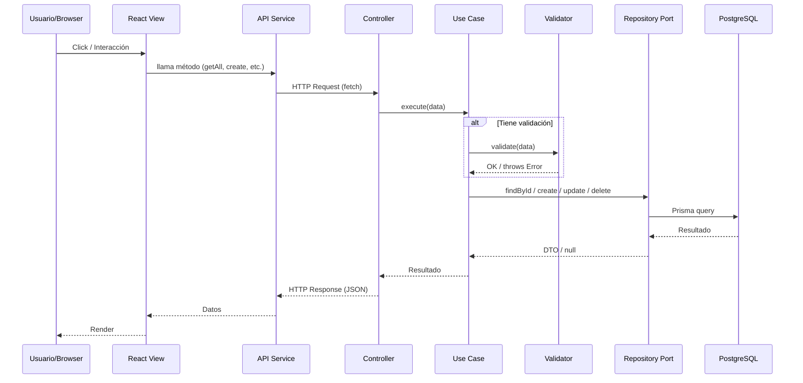
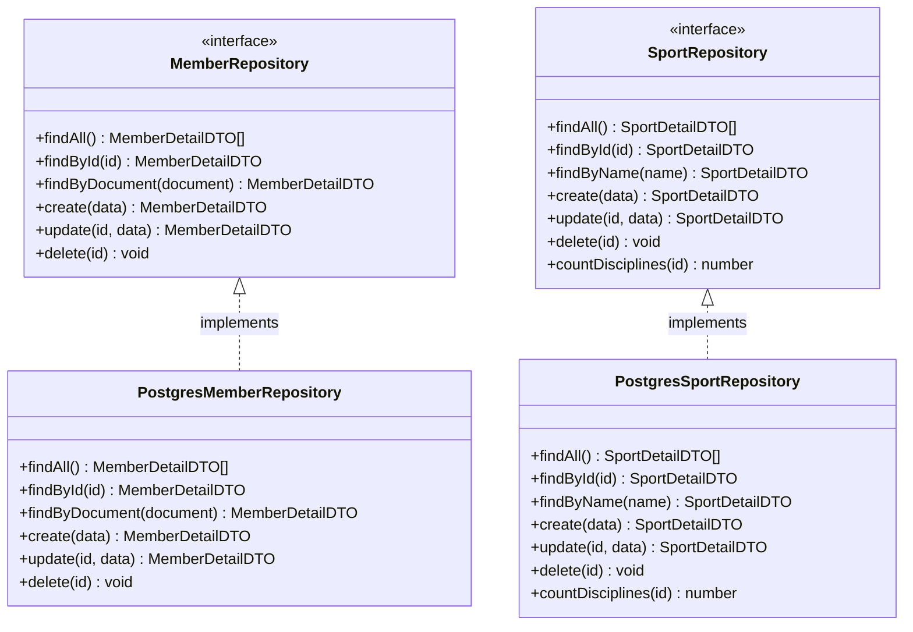
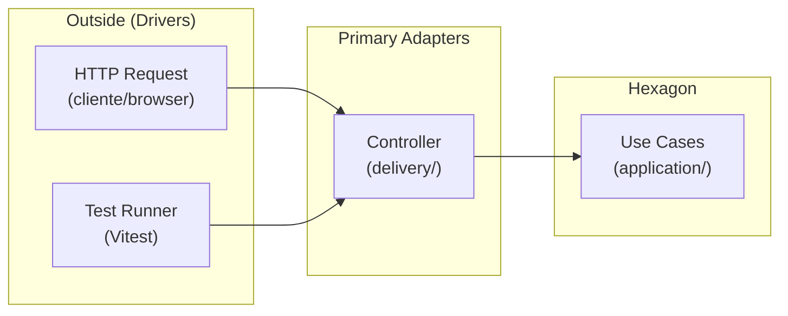
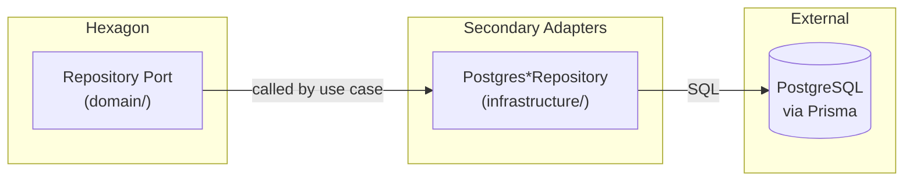
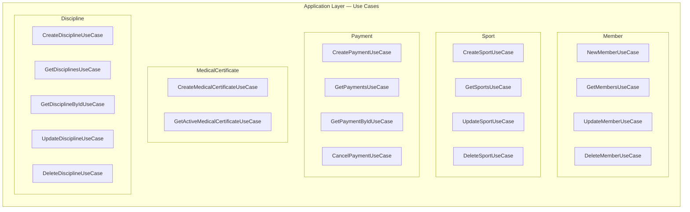
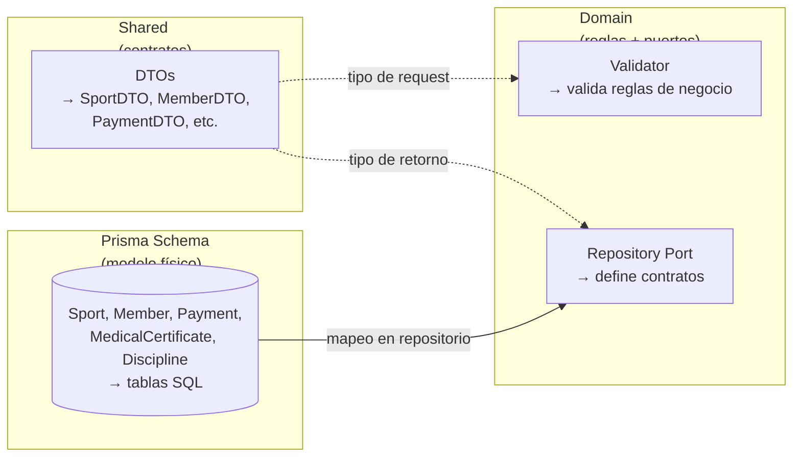
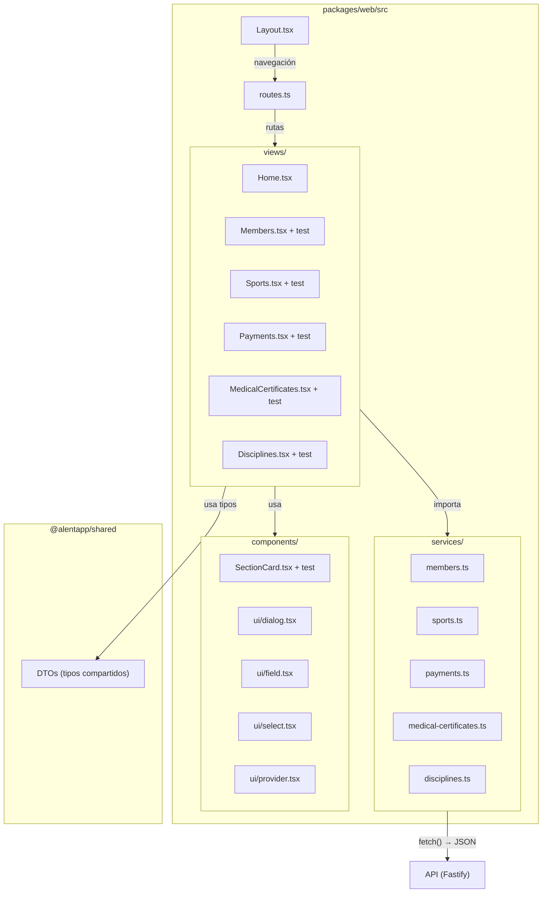
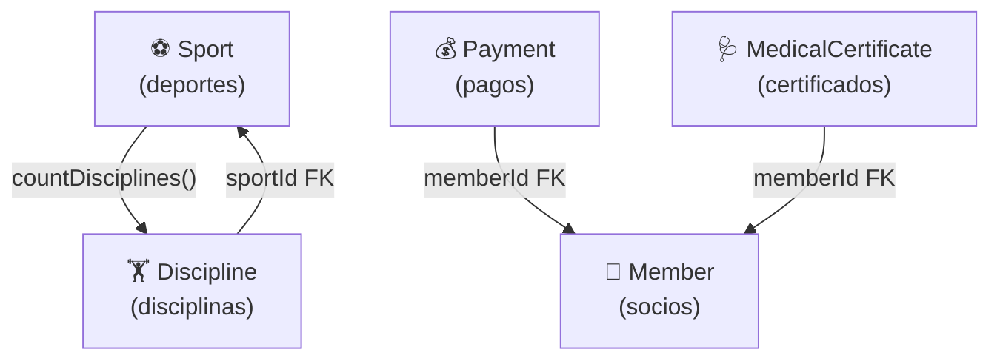
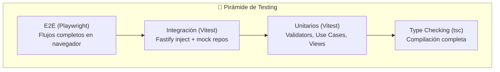

# Mapa de Arquitectura Hexagonal — Alentapp Docente

> **Propósito**: Catálogo completo de todos los componentes de la arquitectura hexagonal del proyecto. Cada puerto, adaptador, caso de uso, entidad, controlador y servicio está documentado con su ubicación, dependencias y role.

---

## Índice

1. [Diagrama General de Capas](#1-diagrama-general-de-capas)
2. [Flujo de una Request](#2-flujo-de-una-request)
3. [Catálogo de Componentes por Entidad](#3-catálogo-de-componentes-por-entidad)
   - [Member (Socio)](#31-member)
   - [Sport (Deporte)](#32-sport)
   - [Payment (Pago)](#33-payment)
   - [MedicalCertificate (Certificado Médico)](#34-medicalcertificate)
   - [Discipline (Disciplina)](#35-discipline)
4. [Puertos (Ports)](#4-puertos-ports)
5. [Adaptadores Primarios (Drivers)](#5-adaptadores-primarios-drivers)
6. [Adaptadores Secundarios (Driven)](#6-adaptadores-secundarios-driven)
7. [Casos de Uso (Application)](#7-casos-de-uso-application)
8. [Entidades de Dominio vs. Modelo de Datos](#8-entidades-de-dominio-vs-modelo-de-datos)
9. [DTOs Compartidos](#9-dtos-compartidos)
10. [Frontend (React)](#10-frontend-react)
11. [Mapa de Dependencias entre Entidades](#11-mapa-de-dependencias-entre-entidades)

---

## 1. Diagrama General de Capas

```mermaid
graph TB
    subgraph Frontend["🌐 Frontend — packages/web"]
        Views["views/*.tsx<br/>Componentes React"]
        Services["services/*.ts<br/>API Client"]
    end

    subgraph Delivery["📡 Delivery — primary/driver adapters"]
        Controllers["delivery/*Controller.ts<br/>Fastify Handlers"]
    end

    subgraph Application["⚙️ Application — use cases"]
        UseCases["application/*UseCase.ts<br/>Casos de uso"]
    end

    subgraph Domain["🧠 Domain — business logic"]
        Ports["domain/*Repository.ts<br/>Puertos (interfaces)"]
        Validators["domain/services/*Validator.ts<br/>Reglas de negocio"]
        Errors["domain/errors.ts<br/>Errores de dominio"]
    end

    subgraph Infrastructure["🗄️ Infrastructure — driven/secondary adapters"]
        Repos["infrastructure/Postgres*Repository.ts<br/>Implementaciones Prisma"]
    end

    subgraph Shared["📦 Shared — packages/shared"]
        DTOs["index.ts<br/>DTOs compartidos"]
    end

    subgraph DB[("🐘 PostgreSQL")]
        Prisma[("Prisma ORM")]
    end

    %% Layer connections
    Views -->|"HTTP Request"| Controllers
    Services -->|"fetch()"| Controllers
    Controllers -->|"parse/validate"| DTOs
    Controllers -->|"execute"| UseCases
    UseCases -->|"validate"| Validators
    UseCases -->|"persist/query"| Ports
    Ports -->|"implemented by"| Repos
    Repos -->|"SQL"| Prisma
    Prisma --> DB
    UseCases -->|"returns"| DTOs
    Controllers -->|"returns"| DTOs
```

---

## 2. Flujo de una Request



---

## 3. Catálogo de Componentes por Entidad

### 3.1. Member

| Componente | Tipo | Archivo | Role |
|---|---|---|---|
| `MemberRepository` | **Puerto** (domain) | `domain/MemberRepository.ts` | Interfaz del repositorio |
| `MemberValidator` | Servicio de dominio | `domain/services/MemberValidator.ts` | Validación de reglas de negocio |
| `NewMemberUseCase` | **Driver** (application) | `application/NewMemberUseCase.ts` | Crear socio |
| `GetMembersUseCase` | **Driver** (application) | `application/GetMembersUseCase.ts` | Listar socios |
| `UpdateMemberUseCase` | **Driver** (application) | `application/UpdateMemberUseCase.ts` | Actualizar socio |
| `DeleteMemberUseCase` | **Driver** (application) | `application/DeleteMemberUseCase.ts` | Eliminar socio |
| `MemberController` | **Driver** (delivery) | `delivery/MemberController.ts` | Handler HTTP |
| `PostgresMemberRepository` | **Driven** (infrastructure) | `infrastructure/PostgresMemberRepository.ts` | Implementación Prisma |

**Endpoints**: `POST/GET/PUT/DELETE /api/v1/socios`

### 3.2. Sport

| Componente | Tipo | Archivo | Role |
|---|---|---|---|
| `SportRepository` | **Puerto** (domain) | `domain/SportRepository.ts` | Interfaz del repositorio (7 métodos) |
| `SportValidator` | Servicio de dominio | `domain/services/SportValidator.ts` | Validación: nombre único, capacidad > 0, nombre inmutable |
| `CreateSportUseCase` | **Driver** (application) | `application/CreateSportUseCase.ts` | Crear deporte |
| `GetSportsUseCase` | **Driver** (application) | `application/GetSportsUseCase.ts` | Listar deportes |
| `UpdateSportUseCase` | **Driver** (application) | `application/UpdateSportUseCase.ts` | Actualizar (nombre NO se modifica) |
| `DeleteSportUseCase` | **Driver** (application) | `application/DeleteSportUseCase.ts` | Eliminar (solo si disciplineCount = 0) |
| `SportController` | **Driver** (delivery) | `delivery/SportController.ts` | Handler HTTP |
| `PostgresSportRepository` | **Driven** (infrastructure) | `infrastructure/PostgresSportRepository.ts` | Implementación Prisma con `_count` |

**Endpoints**: `POST/GET/PUT/DELETE /api/v1/sports`

### 3.3. Payment

| Componente | Tipo | Archivo | Role |
|---|---|---|---|
| `PaymentRepository` | **Puerto** (domain) | `domain/PaymentRepository.ts` | Interfaz del repositorio (findAll paginado) |
| `PaymentValidator` | Servicio de dominio | `domain/services/PaymentValidator.ts` | Validación: monto > 0, miembro existe, estado válido |
| `CreatePaymentUseCase` | **Driver** (application) | `application/CreatePaymentUseCase.ts` | Crear pago |
| `GetPaymentsUseCase` | **Driver** (application) | `application/GetPaymentsUseCase.ts` | Listar con filtros y paginación |
| `GetPaymentByIdUseCase` | **Driver** (application) | `application/GetPaymentByIdUseCase.ts` | Obtener por ID |
| `CancelPaymentUseCase` | **Driver** (application) | `application/CancelPaymentUseCase.ts` | Cancelar pago (no hay DELETE) |
| `PaymentController` | **Driver** (delivery) | `delivery/PaymentController.ts` | Handler HTTP |
| `PostgresPaymentRepository` | **Driven** (infrastructure) | `infrastructure/PostgresPaymentRepository.ts` | Implementación Prisma con paginación |

**Endpoints**: `POST/GET/GET/:id /api/v1/pagos` + `PUT /:id/cancel`

### 3.4. MedicalCertificate

| Componente | Tipo | Archivo | Role |
|---|---|---|---|
| `MedicalCertificateRepository` | **Puerto** (domain) | `domain/MedicalCertificateRepository.ts` | Interfaz del repositorio |
| `MedicalCertificateValidator` | Servicio de dominio | `domain/services/MedicalCertificateValidator.ts` | Validación: fechas, miembro existe |
| `CreateMedicalCertificateUseCase` | **Driver** (application) | `application/CreateMedicalCertificateUseCase.ts` | Crear (desactiva anteriores atómicamente) |
| `GetActiveMedicalCertificateUseCase` | **Driver** (application) | `application/GetActiveMedicalCertificateUseCase.ts` | Obtener certificado activo |
| `MedicalCertificateController` | **Driver** (delivery) | `delivery/MedicalCertificateController.ts` | Handler HTTP |
| `PostgresMedicalCertificateRepository` | **Driven** (infrastructure) | `infrastructure/PostgresMedicalCertificateRepository.ts` | Implementación Prisma con transacciones |

**Endpoints**: `POST /api/v1/certificados-medicos` + `GET /activo/:memberId`

### 3.5. Discipline

| Componente | Tipo | Archivo | Role |
|---|---|---|---|
| `DisciplineRepository` | **Puerto** (domain) | `domain/DisciplineRepository.ts` | Interfaz del repositorio |
| `DisciplineValidator` | Servicio de dominio | `domain/services/DisciplineValidator.ts` | Validación: fechas, deporte existe |
| `CreateDisciplineUseCase` | **Driver** (application) | `application/CreateDisciplineUseCase.ts` | Crear disciplina |
| `GetDisciplinesUseCase` | **Driver** (application) | `application/GetDisciplinesUseCase.ts` | Listar con filtro sportId |
| `GetDisciplineByIdUseCase` | **Driver** (application) | `application/GetDisciplineByIdUseCase.ts` | Obtener por ID |
| `UpdateDisciplineUseCase` | **Driver** (application) | `application/UpdateDisciplineUseCase.ts` | Actualizar (revalida fechas) |
| `DeleteDisciplineUseCase` | **Driver** (application) | `application/DeleteDisciplineUseCase.ts` | Eliminación física |
| `DisciplineController` | **Driver** (delivery) | `delivery/DisciplineController.ts` | Handler HTTP |
| `PostgresDisciplineRepository` | **Driven** (infrastructure) | `infrastructure/PostgresDisciplineRepository.ts` | Implementación Prisma |

**Endpoints**: `POST/GET/GET/:id/PUT/DELETE /api/v1/disciplinas`

---

## 4. Puertos (Ports)

Los puertos son **interfaces** en la capa de dominio que definen contratos. Los adaptadores los implementan.



| Puerto (Interfaz) | Métodos | Implementación |
|---|---|---|
| `MemberRepository` | findAll, findById, findByDocument, create, update, delete | `PostgresMemberRepository` |
| `SportRepository` | findAll, findById, findByName, create, update, delete, countDisciplines | `PostgresSportRepository` |
| `PaymentRepository` | create, findById, findAll, cancel, findMemberById | `PostgresPaymentRepository` |
| `MedicalCertificateRepository` | create, findActiveByMember, deactivateAllByMember | `PostgresMedicalCertificateRepository` |
| `DisciplineRepository` | create, findById, findAll, update, delete | `PostgresDisciplineRepository` |

---

## 5. Adaptadores Primarios (Drivers)

Los **drivers** son adaptadores que *inician* la comunicación. Envían datos hacia adentro del hexágono. En este proyecto son los **Controllers** y los **tests**.



| Adaptador Driver | Entidad | Tecnología | Role |
|---|---|---|---|
| `MemberController` | Member | Fastify | Traduce HTTP → casos de uso |
| `SportController` | Sport | Fastify | Traduce HTTP → casos de uso |
| `PaymentController` | Payment | Fastify | Traduce HTTP → casos de uso (incluye cancel) |
| `MedicalCertificateController` | MedicalCertificate | Fastify | Traduce HTTP → casos de uso |
| `DisciplineController` | Discipline | Fastify | Traduce HTTP → casos de uso |
| Tests unitarios | Todas | Vitest | Driver que ejecuta casos de uso directamente |
| Tests de integración | Todas | Vitest + Fastify.inject | Driver que ejecuta HTTP real sin servidor |

---

## 6. Adaptadores Secundarios (Driven)

Los **driven** son adaptadores que *reciben* comunicación desde el hexágono. Implementan los puertos definidos en dominio.



| Adaptador Driven | Puerto que implementa | Tecnología | Role |
|---|---|---|---|
| `PostgresMemberRepository` | `MemberRepository` | Prisma + PostgreSQL | Persistencia de socios |
| `PostgresSportRepository` | `SportRepository` | Prisma + PostgreSQL | Persistencia de deportes (incluye `_count` disciplinas) |
| `PostgresPaymentRepository` | `PaymentRepository` | Prisma + PostgreSQL | Persistencia de pagos (findAll dinámico con skip/take) |
| `PostgresMedicalCertificateRepository` | `MedicalCertificateRepository` | Prisma + PostgreSQL | Persistencia con transacciones (`$transaction`) |
| `PostgresDisciplineRepository` | `DisciplineRepository` | Prisma + PostgreSQL | Persistencia de disciplinas |

---

## 7. Casos de Uso (Application)



| Caso de Uso | Entidad | Operación | Dependencias | Comportamiento Clave |
|---|---|---|---|---|
| `NewMemberUseCase` | Member | Create | MemberRepository, MemberValidator | — |
| `GetMembersUseCase` | Member | Read (list) | MemberRepository | — |
| `UpdateMemberUseCase` | Member | Update | MemberRepository, MemberValidator | — |
| `DeleteMemberUseCase` | Member | Delete | MemberRepository | — |
| `CreateSportUseCase` | Sport | Create | SportRepository, SportValidator | Valida unicidad de nombre |
| `GetSportsUseCase` | Sport | Read (list) | SportRepository | — |
| `UpdateSportUseCase` | Sport | Update | SportRepository, SportValidator | Bloquea cambio de nombre |
| `DeleteSportUseCase` | Sport | Delete | SportRepository | Bloquea si disciplineCount > 0 |
| `CreatePaymentUseCase` | Payment | Create | PaymentRepository, MemberRepository, PaymentValidator | Valida monto, miembro |
| `GetPaymentsUseCase` | Payment | Read (list) | PaymentRepository, PaymentValidator | Filtros + paginación |
| `GetPaymentByIdUseCase` | Payment | Read (one) | PaymentRepository | — |
| `CancelPaymentUseCase` | Payment | Update (cancel) | PaymentRepository, PaymentValidator | Transición de estado |
| `CreateMedicalCertificateUseCase` | MedicalCertificate | Create | MedicalCertificateRepository, MemberRepository, MedicalCertificateValidator | Desactiva anteriores + crea nuevo (transacción) |
| `GetActiveMedicalCertificateUseCase` | MedicalCertificate | Read (active) | MedicalCertificateRepository | — |
| `CreateDisciplineUseCase` | Discipline | Create | DisciplineRepository, DisciplineValidator | Valida fechas |
| `GetDisciplinesUseCase` | Discipline | Read (list) | DisciplineRepository | Filtro sportId opcional |
| `GetDisciplineByIdUseCase` | Discipline | Read (one) | DisciplineRepository | — |
| `UpdateDisciplineUseCase` | Discipline | Update | DisciplineRepository, DisciplineValidator | Revalida fechas si cambiaron |
| `DeleteDisciplineUseCase` | Discipline | Delete | DisciplineRepository | Hard delete |

---

## 8. Entidades de Dominio vs. Modelo de Datos

En esta arquitectura, las **entidades de dominio** están definidas implícitamente por los **DTOs** y las **reglas de validación**, no por clases ORM. No hay entidades `class` en el sentido clásico de DDD — los datos viajan como objetos planos (interfaces TypeScript) y la lógica está en los **validators** y **use cases**.



| Concepto Físico (Prisma) | Concepto Lógico (DTO) | Reglas (Validator) |
|---|---|---|
| `sport` table | `SportDTO`, `SportDetailDTO` | nombre único, maxCapacity > 0, nombre inmutable |
| `member` table | `MemberDetailDTO` | documento único, email válido |
| `payment` table | `PaymentDTO`, `PaymentDetailDTO` | monto > 0, estados válidos, miembro existe |
| `medical_certificate` table | `MedicalCertificateDTO` | fechas válidas, miembro existe, activo único |
| `discipline` table | `DisciplineDTO`, `DisciplineDetailDTO` | endDate > startDate, deporte existe |

---

## 9. DTOs Compartidos

Todos los DTOs viven en `packages/shared/index.ts` y son consumidos por API y Frontend.

| DTO | Propósito | Extiende |
|---|---|---|
| `SportDTO` | Deporte base | — |
| `SportDetailDTO` | Deporte + disciplineCount | `SportDTO` |
| `MemberDetailDTO` | Socio completo | — |
| `PaymentDTO` | Pago base | — |
| `PaymentDetailDTO` | Pago + nombre del miembro | `PaymentDTO` |
| `PaginatedResponse<T>` | Respuesta paginada genérica | — |
| `PaymentFilters` | Filtros de búsqueda | — |
| `MedicalCertificateDTO` | Certificado médico | — |
| `DisciplineDTO` | Disciplina base | — |
| `DisciplineDetailDTO` | Disciplina + nombre del deporte | `DisciplineDTO` |
| `CreateSportRequest` | Crear deporte | — |
| `UpdateSportRequest` | Actualizar deporte (sin name) | — |
| `CreatePaymentRequest` | Crear pago | — |
| `CreateMedicalCertificateRequest` | Crear certificado | — |
| `CreateDisciplineRequest` | Crear disciplina | — |
| `UpdateDisciplineRequest` | Actualizar disciplina (todo opcional) | — |

---

## 10. Frontend (React)



| Vista (View) | Servicio (Service) | Ruta | Endpoint API |
|---|---|---|---|
| `Home.tsx` | — | `/` | — |
| `Members.tsx` | `members.ts` | `/members` | `/api/v1/socios` |
| `Sports.tsx` | `sports.ts` | `/sports` | `/api/v1/sports` |
| `Payments.tsx` | `payments.ts` | `/pagos` | `/api/v1/pagos` |
| `MedicalCertificates.tsx` | `medical-certificates.ts` | `/certificados-medicos` | `/api/v1/certificados-medicos` |
| `Disciplines.tsx` | `disciplines.ts` | `/disciplinas` | `/api/v1/disciplinas` |

---

## 11. Mapa de Dependencias entre Entidades



| Entidad | Depende de | Tipo de Dependencia |
|---|---|---|
| Discipline | Sport | FK `sportId` + valida que el deporte exista (`DisciplineValidator`) |
| Payment | Member | FK `memberId` + valida que el socio exista |
| MedicalCertificate | Member | FK `memberId` + valida que el socio exista |
| Sport | Discipline | Solo para conteo (`countDisciplines()` — bloquea delete si > 0) |

---

## 12. Errores de Dominio

Definidos en `domain/errors.ts` — todos los casos de uso lanzan estos errores, y los controllers los mapean a códigos HTTP:

| Error | HTTP Status | Uso |
|---|---|---|
| `ValidationError` | 400 | Datos inválidos, reglas de negocio violadas |
| `NotFoundError` | 404 | Entidad no encontrada por ID |
| `ConflictError` | 409 | Violación de unicidad (nombre duplicado) |

---

## 13. Resumen de Archivos por Capa

| Capa | Cantidad de archivos | Propósito |
|---|---|---|
| `domain/` | 8 (5 repos + 5 validators + 1 errors) | Interfaces y reglas de negocio |
| `application/` | 19 (19 use cases) | Casos de uso (orquestación) |
| `delivery/` | 10 (5 controllers + 5 test files) | Adaptadores HTTP |
| `infrastructure/` | 5 (5 repos) | Implementaciones Prisma |
| `shared/index.ts` | 1 | DTOs (16 tipos exportados) |
| `web/services/` | 5 (5 services) | Clientes HTTP frontend |
| `web/views/` | 6 (6 views + tests) | Componentes React |

---

## 14. Testing — Pirámide y Estrategia



### 14.1. Tests por Capa Hexagonal

| Capa Hexagonal | Tipo de Test | Archivo de Test | Cantidad |
|---|---|---|---|
| **Domain** (validators) | Unitario | `domain/services/*Validator.test.ts` | 5 archivos |
| **Application** (use cases) | Unitario | `application/*UseCase.test.ts` | 14 archivos |
| **Delivery** (controllers) | Unitario + Integración | `delivery/*Controller.test.ts` + `*.integration.test.ts` | 8 archivos |
| **Infrastructure** (repos) | — | (cubierto por integración) | — |
| **Frontend views** | Unitario (UI) | `views/*.test.tsx` | 7 archivos |
| **Frontend components** | Unitario | `components/*.test.tsx` | 1 archivo |
| **E2E** | Full-stack | `e2e-fullstack/*.spec.ts`, `e2e/*.spec.ts`, `delivery/*.e2e.test.ts` | 3 archivos |

### 14.2. Inventario Actual (238 tests)

| Estado | Cantidad |
|---|---|
| ✅ Pasando | 197 |
| ❌ Fallando | 41 |
| **Total** | **238** |

**Distribución por paquete:**

| Paquete | Tests | Estado |
|---|---|---|
| `packages/api` | 197 tests | ✅ Pasan (desde API vitest config) |
| `packages/web` | 41 tests | ❌ Fallan por config (jsdom) — ejecutar con `npm -w packages/web run test` |

### 14.3. Patrones de Testing

| Patrón | Archivo de Referencia | Técnica |
|---|---|---|
| **Validator test** | `SportValidator.test.ts` | Función pura, sin mocks, ~2ms por test |
| **Use Case test** | `CreateSportUseCase.test.ts` | Mock del puerto (interfaz), inyectar en constructor |
| **Controller unit test** | `SportController.test.ts` | Mock de use cases con `vi.fn()`, verificar HTTP |
| **Controller integration** | `SportController.integration.test.ts` | `app.inject()` sin servidor, mock repository |
| **Frontend view test** | `Sports.test.tsx` | Testing Library + `userEvent`, mock service |
| **E2E** | `members.spec.ts` (web), `members.fullstack.spec.ts` | Playwright + Docker (full-stack) |

### 14.4. Stack de Testing

| Herramienta | Propósito | Comando |
|---|---|---|
| Vitest 4 | Test runner (unit + integration) | `npm test` |
| @testing-library/react | Renderizar React en tests | — |
| @testing-library/user-event | Simular interacción del usuario | — |
| jsdom | Entorno browser en Node.js | — |
| Playwright 1.59 | E2E browser automation | `npm run test:e2e` |
| @vitest/coverage-v8 | Reporte de cobertura | `npm run test:coverage` |
| ESLint 9 | Static analysis | — |
| TypeScript 6 | Type checking | `npx tsc --noEmit` |

### 14.5. Cómo Ejecutar

```bash
# Todos los tests
npm test

# Tests por paquete
npm run test:api
npm run test:web

# Coverage
npm run test:coverage

# TUI interactivo
bash scripts/test-runner.sh
```

Para más detalle, ver `docs/testing/strategy.md`.

---

> **Mantenimiento**: Al agregar una nueva entidad, agregar una fila en cada tabla de este documento (Puertos, Adaptadores, Casos de Uso, DTOs, Frontend, Tests). Los diagramas Mermaid se renderizan automáticamente en GitHub.
