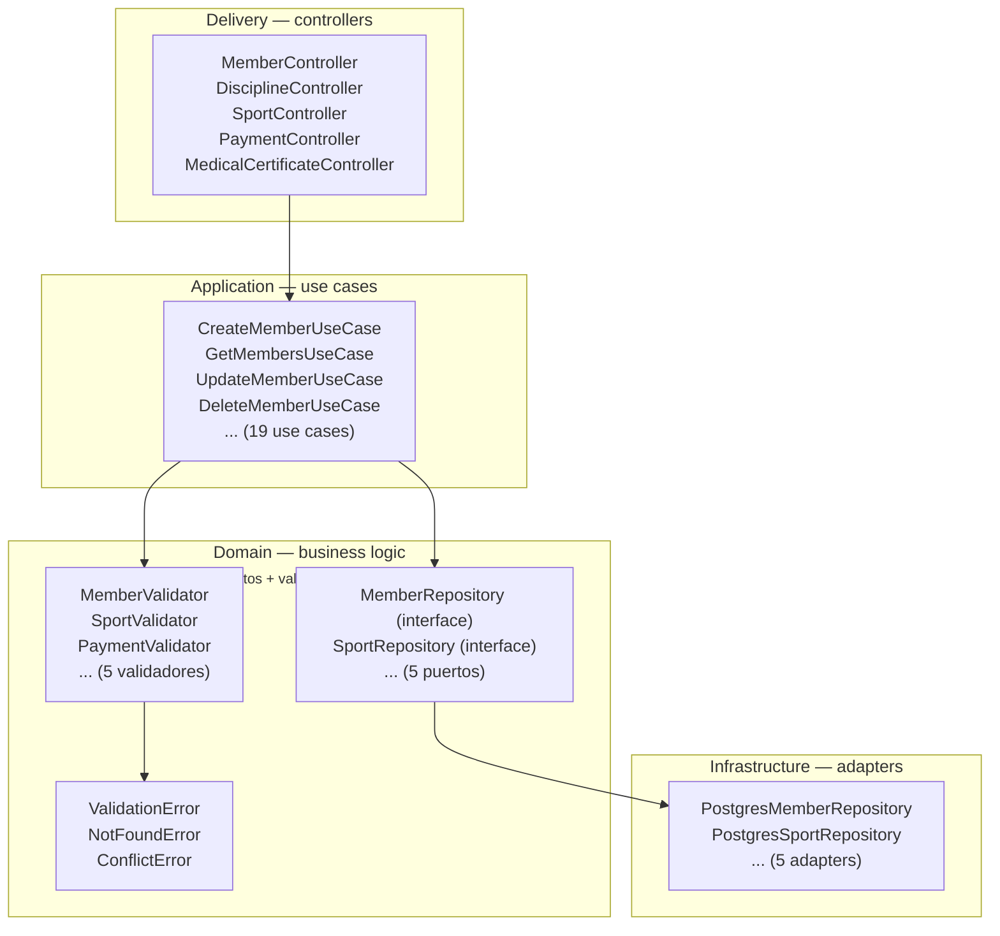
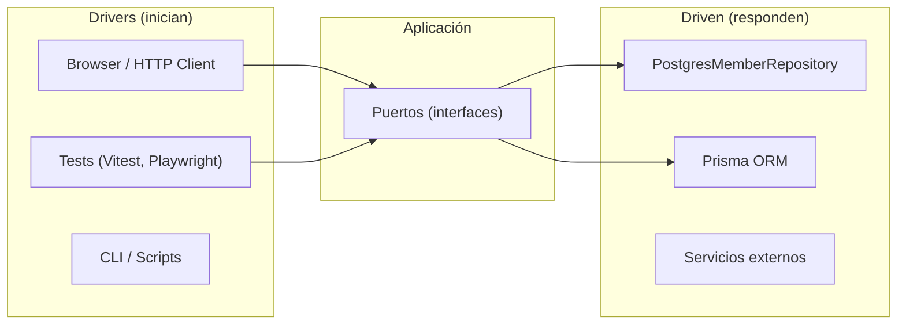
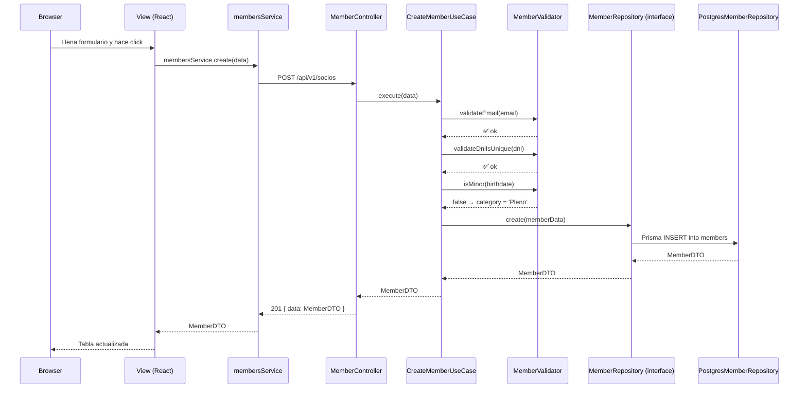
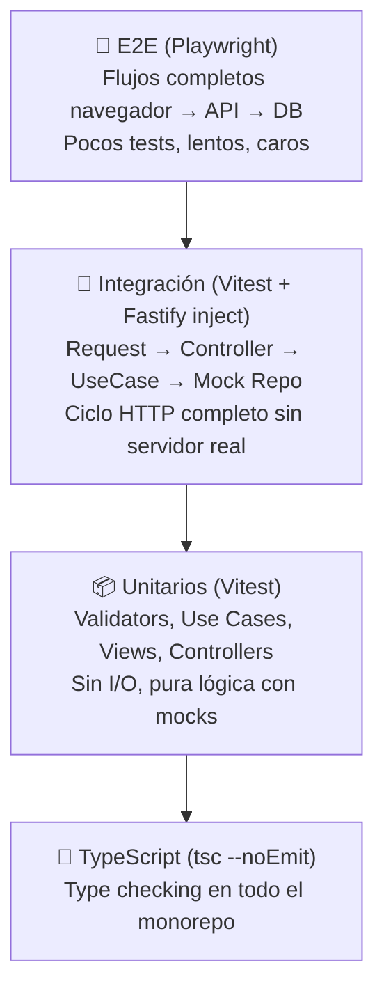

<!--
marp: true
theme: uncover
class:
  - lead
  - invert
paginate: true
-->

# Arquitectura Hexagonal y Estrategia de Testing

## Alentapp Docente — Notas de Clase

**Ingeniería de Software — 2026**

---

## Agenda

- ¿Qué es Arquitectura Hexagonal?
- Las capas del hexágono
- Drivers vs Driven
- Nuestras entidades
- Flujo de una request
- Mapa de archivos por capa
- ¿Por qué hexagonal?
- Pirámide de testing
- Tests unitarios
- Tests de integración
- Tests E2E
- Cobertura y otros tipos
- Cómo ejecutar los tests
- Recomendaciones para el TP

---

## ¿Qué es Arquitectura Hexagonal?

> **"Hexagonal Architecture"** — Alistair Cockburn, 2005

- También llamada **Puertos y Adaptadores (Ports & Adapters)**
- El hexágono no es obligatorio: se llama así por el dibujo original de Cockburn. Podrían ser cuadrados, círculos, lo que quieras.

**La idea central:** el negocio (domain) no sabe nada del mundo exterior.

- No sabe si la request llegó por HTTP, WebSocket, o línea de comandos.
- No sabe si los datos están en PostgreSQL, MongoDB, o en un archivo JSON.
- El dominio define contratos (interfaces) y el mundo exterior los implementa.

```
                    ┌──────────────────┐
                    │   Controllers    │  ← Entrada (HTTP, CLI, ...)
                    └────────┬─────────┘
                             │
                    ┌────────▼─────────┐
                    │   Use Cases      │  ← Orquestación
                    └────────┬─────────┘
                             │
                    ┌────────▼─────────┐
                    │   Domain         │  ← CORAZÓN: interfaces + reglas
                    └────────┬─────────┘
                             │
                    ┌────────▼─────────┐
                    │  Repositories    │  ← Salida (Postgres, Mongo, ...)
                    └──────────────────┘
```

---

## Las Capas del Hexágono



**Regla de oro:** las flechas apuntan hacia adentro. El dominio no importa nada de las capas externas.

---

## Drivers vs Driven

La arquitectura hexagonal distingue **quién inicia** la comunicación:



| Tipo | ¿Quién controla? | Ejemplos |
|---|---|---|
| **Driver** | El agente externo inicia la comunicación | Controllers HTTP, tests |
| **Driven** | La app inicia, el externo responde | Repositorios, mailers, APIs externas |

Los tests se comportan como drivers: llaman a los puertos exactamente como lo haría un controller HTTP.

---

## Nuestras Entidades

| Entidad | Endpoints | Operaciones | Dependencias |
|---|---|---|---|
| **Member** (Socio) | `/api/v1/socios` | CRUD + validaciones de edad y DNI único | MemberValidator |
| **Sport** (Deporte) | `/api/v1/sports` | CRUD + nombre único | SportValidator |
| **Payment** (Pago) | `/api/v1/pagos` | Crear, listar, filtrar, cancelar | PaymentValidator, MemberRepository |
| **MedicalCertificate** (Certificado Médico) | `/api/v1/certificados-medicos` | Crear, obtener activo | MedicalCertificateValidator |
| **Discipline** (Disciplina) | `/api/v1/disciplinas` | CRUD + validar que el deporte existe | DisciplineValidator, SportRepository |

**Datos técnicos:**
- Base de datos: PostgreSQL vía **Prisma ORM**
- Framework HTTP: **Fastify** (delivery layer)
- Motor de frontend: **React + Chakra UI** (SPA)
- Monorepo con **npm workspaces**: `@alentapp/shared`, `@alentapp/api`, `@alentapp/web`

---

## Flujo de una Request



**Puntos clave:**
- El **Controller** y el **Repository** son la frontera del hexágono
- El **Domain** nunca ve HTTP ni Prisma
- Los **DTOs** viajan de punta a punta gracias a `@alentapp/shared`

---

## Mapa de Archivos por Capa

```
packages/
├── shared/                   (1 archivo)
│   └── index.ts              → DTOs, Requests, tipos compartidos
│
├── api/src/
│   ├── domain/               (11 archivos fuente + 5 tests)
│   │   ├── MemberRepository.ts       Puerto (interfaz)
│   │   ├── SportRepository.ts        Puerto
│   │   ├── PaymentRepository.ts      Puerto
│   │   ├── MedicalCertificateRepository.ts Puerto
│   │   ├── DisciplineRepository.ts   Puerto
│   │   ├── errors.ts                 ValidationError, NotFoundError, ConflictError
│   │   └── services/                 5 validadores
│   │
│   ├── application/          (19 use cases + 19 tests)
│   │   ├── CreateMemberUseCase.ts
│   │   ├── NewMemberUseCase.ts
│   │   ├── GetMembersUseCase.ts
│   │   ├── UpdateMemberUseCase.ts
│   │   ├── DeleteMemberUseCase.ts
│   │   ├── CreateSportUseCase.ts
│   │   ├── GetSportsUseCase.ts
│   │   ├── UpdateSportUseCase.ts
│   │   ├── DeleteSportUseCase.ts
│   │   ├── CreatePaymentUseCase.ts
│   │   ├── GetPaymentsUseCase.ts
│   │   ├── GetPaymentByIdUseCase.ts
│   │   ├── CancelPaymentUseCase.ts
│   │   ├── CreateMedicalCertificateUseCase.ts
│   │   ├── GetActiveMedicalCertificateUseCase.ts
│   │   ├── CreateDisciplineUseCase.ts
│   │   ├── GetDisciplinesUseCase.ts
│   │   ├── GetDisciplineByIdUseCase.ts
│   │   ├── UpdateDisciplineUseCase.ts
│   │   └── DeleteDisciplineUseCase.ts
│   │
│   ├── delivery/             (5 controllers + 10 tests)
│   │   ├── MemberController.ts
│   │   ├── SportController.ts
│   │   ├── PaymentController.ts
│   │   ├── MedicalCertificateController.ts
│   │   └── DisciplineController.ts
│   │
│   └── infrastructure/       (5 adapters)
│       ├── PostgresMemberRepository.ts
│       ├── PostgresSportRepository.ts
│       ├── PostgresPaymentRepository.ts
│       ├── PostgresMedicalCertificateRepository.ts
│       └── PostgresDisciplineRepository.ts
│
└── web/src/
    ├── views/                (6 vistas + 6 tests)
    │   ├── Members.tsx
    │   ├── Sports.tsx
    │   ├── Payments.tsx
    │   ├── MedicalCertificates.tsx
    │   ├── Disciplines.tsx
    │   └── Home.tsx
    ├── components/           (Componentes reutilizables)
    └── services/             (5 servicios HTTP)
```

---

## ¿Por Qué Hexagonal?

### 1. Testeabilidad

```typescript
// Test de CreateMemberUseCase sin base de datos real
const mockMemberRepo = {
    create: vi.fn(),
} as unknown as MemberRepository;

const useCase = new CreateMemberUseCase(mockMemberRepo, mockMemberValidator);

const result = await useCase.execute(mockRequest);

expect(mockMemberValidator.validateEmail).toHaveBeenCalledWith(mockRequest.email);
expect(mockMemberRepo.create).toHaveBeenCalledWith(expect.objectContaining({
    category: 'Pleno',
    status: 'Activo'
}));
```

### 2. Tolerancia al cambio
- Si mañana cambiamos de Prisma a Drizzle, solo tocamos `infrastructure/`
- Si pasamos de REST a GraphQL, solo tocamos `delivery/`
- Si queremos agregar una CLI, creamos otro delivery que use los mismos use cases

### 3. Multi-protocolo
- Hoy exponemos REST con Fastify
- Mañana podemos agregar WebSockets, CLI, o cola de mensajes
- Los use cases reciben los mismos DTOs y devuelven los mismos resultados

### 4. Escalabilidad del equipo
- Cada desarrollador puede trabajar en una capa distinta
- Mientras los contratos (interfaces) se respeten, no hay conflictos
- Los tests unitarios son rápidos y no requieren infraestructura

---

## Pirámide de Testing



**Principio:** la mayoría de bugs se encuentran en los niveles inferiores, que son más rápidos y baratos.

| Nivel | Velocidad | Confianza | Costo de mantenimiento |
|---|---|---|---|
| Unitario | ⚡⚡⚡⚡⚡ | Media | Bajo |
| Integración | ⚡⚡⚡⚡ | Alta | Medio |
| E2E | ⚡ | Muy alta | Alto |

---

## Tests Unitarios

### ¿Qué testear?

| Capa | ¿Qué probamos? | ¿Cómo? |
|---|---|---|
| **Validators** (domain) | Reglas de negocio puras | Llamar a cada método con datos válidos e inválidos |
| **Use Cases** (application) | Orquestación + propagación de errores | Mockear repositorios, ejercitar cada camino |
| **Controllers** (delivery) | Mapeo HTTP → UseCase → status code | Mockear use cases, verificar `reply.status()` |
| **Views** (frontend) | Renderizado, interacciones, estados | Mockear servicios HTTP con `vi.mock()` |

### ¿Qué NO testear con unit tests?

- Repositorios reales (son de integración)
- Queries a la base de datos
- Enrutamiento HTTP
- Conexiones de red

### Ejemplo: test de controlador

```typescript
describe('MemberController', () => {
    const mockCreateUseCase = { execute: vi.fn() };
    const controller = new MemberController(mockCreateUseCase as any, ...);

    it('debe devolver 201 si la creación es exitosa', async () => {
        mockCreateUseCase.execute.mockResolvedValueOnce({ id: '1', name: 'Juan' });

        await controller.create(mockRequest as any, mockReply as any);

        expect(mockReply.status).toHaveBeenCalledWith(201);
        expect(mockReply.send).toHaveBeenCalledWith({ data: { id: '1', name: 'Juan' } });
    });

    it('debe devolver 409 Conflict si el DNI ya existe', async () => {
        mockCreateUseCase.execute.mockRejectedValueOnce(
            new Error('Ya existe un miembro con ese DNI')
        );

        await controller.create(mockRequest as any, mockReply as any);

        expect(mockReply.status).toHaveBeenCalledWith(409);
    });
});
```

---

## Tests de Integración

### Fastify inject: el truco que hace todo más fácil

Fastify tiene un método `inject()` que simula requests HTTP **sin levantar un servidor real**.

```typescript
vi.mock('../infrastructure/PostgresMemberRepository.js', () => {
    return {
        PostgresMemberRepository: class {
            async findAll() { return [{ id: '1', name: 'Socio Existente' }]; }
            async findByDni(dni) { return dni === '12345678' ? { id: '1' } : null; }
            async create(data) { return { id: '2', ...data }; }
        }
    };
});

describe('Member API Integration', () => {
    let app: FastifyInstance;

    beforeAll(async () => {
        app = buildApp(); // Construye la app completa
        await app.ready();
    });

    it('POST /api/v1/socios — debe crear y retornar 201', async () => {
        const response = await app.inject({
            method: 'POST',
            url: '/api/v1/socios',
            payload: { name: 'Test', dni: '88888888', email: 'test@test.com', ... }
        });

        expect(response.statusCode).toBe(201);
        expect(JSON.parse(response.payload).data.name).toBe('Test');
    });
});
```

**¿Qué se testea en integración?**
- ✅ El mapeo de rutas (que `POST /api/v1/socios` llegue al método correcto)
- ✅ La propagación de errores (validator → use case → controller → HTTP status)
- ✅ La serialización del response (que el body tenga `{ data: ... }`)

**¿Qué está mockeado?**
- Los repositorios (no hay base de datos real)
- La app se construye completa con `buildApp()`

---

## Tests E2E

### Tres niveles de E2E

#### 1. E2E con mocks de red (Playwright + route intercept)

```typescript
test('debe crear un socio desde el navegador', async ({ page }) => {
    await page.route(/\/api\/v1\/socios/, async (route) => {
        if (route.request().method() === 'POST') {
            await route.fulfill({ status: 201, body: JSON.stringify({ data: newMember }) });
        }
    });

    await page.goto('/members');
    await page.getByText('Agregar Miembro').click();
    await page.getByPlaceholder('Ej. Juan Pérez').fill('Socio E2E');
    await page.getByPlaceholder('Ej. 12345678').fill('99999999');
    await page.getByRole('button', { name: 'Crear Miembro' }).click();

    await expect(page.getByText('Socio E2E')).toBeVisible();
});
```

- ✅ Rápidos, deterministas, no requieren base de datos
- ✅ Validan el flujo completo del frontend
- ❌ No detectan errores de contrato API/DB

#### 2. E2E Full-Stack (Playwright + Docker)

```
docker compose -f docker-compose.e2e.yml up -d
# Browser → React → Fastify → PostgreSQL real
```

- ✅ Validan absolutamente todo
- ❌ Lentos, requieren Docker, frágiles

#### 3. Estado actual

| Tipo | Dónde | Cobertura |
|---|---|---|
| E2E con mocks | `packages/web/e2e/` | Member (crear, editar, eliminar) |
| Full-Stack | `e2e-fullstack/` | Member (crear, editar, eliminar) |
| **Limitación** | Solo cubrimos Member | Faltan Sport, Payment, MedicalCertificate, Discipline |

---

## Cobertura y Otros Tipos

### Cobertura actual (Vitest coverage)

```bash
npm run test:coverage
```

Se genera con `@vitest/coverage-v8` y produce reportes HTML en `coverage/`.

### Thresholds recomendados

| Tipo | Mínimo | Ideal |
|---|---|---|
| Statements | 70% | 80%+ |
| Branches | 60% | 75%+ |
| Functions | 70% | 80%+ |
| Lines | 70% | 80%+ |

### Otros tipos de testing que podríamos agregar

| Tipo | Herramienta | ¿Qué detecta? |
|---|---|---|
| **Mutation testing** | Stryker | Código muerto, tests que pasan sin afirmar nada |
| **Property-based** | fast-check | Casos borde que no se te ocurrieron |
| **Accessibility** | axe-core + Playwright | Violaciones de accesibilidad (ARIA, contraste, etc.) |
| **Visual regression** | Playwright snapshot | Cambios visuales no intencionales |
| **API Contract** | OpenAPI + Spraypaint | Que el server cumple el contrato documentado |

> **⚠️ Realidad del proyecto:** hoy tenemos unitarios, integración y E2E. Los otros tipos son _aspiracionales_ — si tu TP se destaca en alguno, suma puntos.

---

## Cómo Ejecutar los Tests

```bash
# === Tests rápidos (no requieren Docker) ===

# Todo el proyecto
npm test

# Solo API (unitarios + integración)
npm run test:api

# Solo Web (unitarios + integración)
npm run test:web

# Solo unitarios de API
npm run test:unit

# Solo integración de API
npm run test:integration

# Con reporte de cobertura
npm run test:coverage

# En modo watch (desarrollo)
npm run test:watch

# === Tests E2E ===

# Con mocks de red (rápido)
npm run test:e2e

# Full-Stack (requiere Docker)
npm run e2e:fullstack:run

# Full-Stack con navegador visible
npm run e2e:fullstack:headed:run

# Full-Stack con UI interactiva
npm run e2e:fullstack:ui:run
```

### Resumen rápido

| Lo que querés hacer | Comando |
|---|---|
| Safety Net antes de pushear | `npm test` |
| Test rápido de un use case | `npm run test:unit` |
| Ver cobertura | `npm run test:coverage` |
| Test de frontend con interacción | `npm run test:e2e` |
| Test de verdad (con Docker) | `npm run e2e:fullstack:run` |

---

## Recomendaciones para el TP

### Por entidad, los tests mínimos

1. **Crear entidad** → 1 test unitario de use case + 1 test de integración del controller
2. **Listar entidad** → 1 test unitario + 1 test de integración
3. **Actualizar entidad** → 1 test unitario (con validación) + 1 test de integración
4. **Eliminar entidad** → 1 test unitario + 1 test de integración
5. **Validaciones** → 1 test por regla de negocio (email inválido, DNI duplicado, etc.)
6. **Errores** → 1 test por error mapeado (404, 409, 400, 500)

### Estructura de archivos

```typescript
// Por cada módulo, tres archivos:
src/
├── application/
│   ├── CreateAlgoUseCase.ts
│   └── CreateAlgoUseCase.test.ts     // Unitario: mockea repos
├── delivery/
│   ├── AlgoController.ts
│   ├── AlgoController.test.ts        // Unitario: mockea use cases
│   └── AlgoController.integration.test.ts  // Integración: mockea repos
└── domain/services/
    ├── AlgoValidator.ts
    └── AlgoValidator.test.ts         // Unitario: lógica pura
```

### Tips

- **Seguí los patrones existentes.** Mirá cómo están escritos `MemberUseCase` y `MemberController` — replicá ese estilo.
- **No copies y pegues tests.** Cada entidad tiene reglas distintas, los tests deben reflejarlas.
- **Corré el Safety Net antes de pushear:** `npm test` + `npm run test:coverage`.
- **Si ves algo raro**, `npm run test:watch` te da feedback instantáneo.
- **Los tests E2E full-stack los corre el CI.** No hace que los tengas corriendo localmente siempre.

---

## Referencias

- **Cockburn, A.** (2005). *Hexagonal Architecture (Ports and Adapters)*. alistair.cockburn.us/hexagonal-architecture
- **Martin, R. C.** (2017). *Clean Architecture: A Craftsman's Guide to Software Structure and Design*. Prentice Hall.
- **Beck, K.** (2002). *Test Driven Development: By Example*. Addison-Wesley.
- **Meszaros, G.** (2007). *xUnit Test Patterns: Refactoring Test Code*. Addison-Wesley.
- **Freeman, S. & Pryce, N.** (2009). *Growing Object-Oriented Software, Guided by Tests*. Addison-Wesley.
- **Fowler, M.** *Patterns of Enterprise Application Architecture*. martinfowler.com

---

## ¿Preguntas?

**Contacto:** Equipo docente de Ingeniería de Software

**Documentación del proyecto:**
- `docs/ARCHITECTURE.md` — Arquitectura detallada
- `docs/TESTING.md` — Estrategia de testing y comandos
- `docs/architecture/hexagonal-map.md` — Mapa de capas

**Repositorio:** Alentapp Docente — Notas de Clase

---

*Esta presentación está en formato Marp. Convertila a slides con:*
```bash
npx marp docs/architecture/presentacion.md -o presentacion.pdf
# o
npx @marp-team/marp-cli docs/architecture/presentacion.md --slides
```
