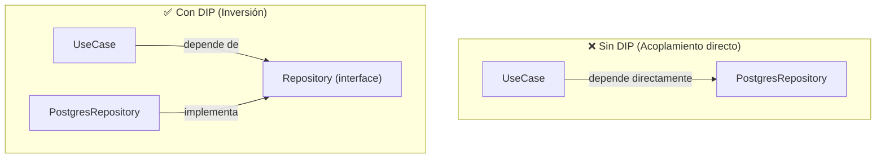
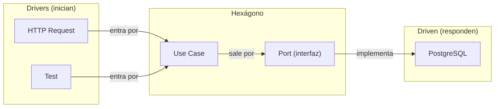

# Notas Académicas: Arquitectura Hexagonal en Alentapp Docente

## Índice

1. [Fundamentos de Arquitectura Hexagonal](#1-fundamentos-de-arquitectura-hexagonal)
2. [Ports & Adapters: La Metáfora del Hexágono](#2-ports--adapters-la-metáfora-del-hexágono)
3. [Principio de Inversión de Dependencias (DIP)](#3-principio-de-inversión-de-dependencias-dip)
4. [Implementación en Alentapp Docente](#4-implementación-en-alentapp-docente)
5. [Drivers vs. Driven: Quién Inicia la Comunicación](#5-drivers-vs-driven-quién-inicia-la-comunicación)
6. [Comparación con Otras Arquitecturas](#6-comparación-con-otras-arquitecturas)
7. [Beneficios para el Proyecto](#7-beneficios-para-el-proyecto)
8. [Tradeoffs y Dónde NO Aplica](#8-tradeoffs-y-dónde-no-aplica)
9. [Referencias Bibliográficas](#9-referencias-bibliográficas)

---

## 1. Fundamentos de Arquitectura Hexagonal

### 1.1. Origen y Motivación

La **Arquitectura Hexagonal** — también conocida como **Ports & Adapters** — fue propuesta por **Alistair Cockburn** en 2005 como respuesta a un problema recurrente en el desarrollo de software: el **acoplamiento entre la lógica de negocio y los detalles técnicos** (bases de datos, frameworks web, APIs externas).

Cockburn observó que la mayoría de las aplicaciones fallaban en un aspecto clave: cuando cambiaba la base de datos, o el framework web, o la UI, la lógica de negocio también se rompía. El objetivo de la arquitectura hexagonal es **proteger el núcleo de la aplicación** de los cambios tecnológicos externos.

### 1.2. La Metáfora

La metáfora central es simple: la aplicación es un **hexágono** (o cualquier polígono — la forma no importa) con un **núcleo interno** que contiene la lógica de negocio, rodeado por **puertos** que definen interfaces de comunicación, y **adaptadores** que conectan esos puertos con el mundo exterior.

```
    ┌─────────────────────────────────────┐
    │           ADAPTADORES               │
    │  ┌───────────────────────────────┐  │
    │  │          PUERTOS              │  │
    │  │  ┌─────────────────────────┐  │  │
    │  │  │    NÚCLEO / DOMINIO     │  │  │
    │  │  │  (lógica de negocio)    │  │  │
    │  │  └─────────────────────────┘  │  │
    │  └───────────────────────────────┘  │
    └─────────────────────────────────────┘
```

### 1.3. Principios Fundamentales

La arquitectura hexagonal se sostiene sobre cuatro principios:

1. **Aislamiento del Dominio**: La lógica de negocio no conoce ni depende de bases de datos, frameworks web, ni ninguna tecnología externa.

2. **Puertos como Contratos**: Las interacciones con el exterior se definen mediante interfaces (puertos) en el lenguaje del dominio.

3. **Adaptadores Intercambiables**: Cada puerto tiene uno o más adaptadores que lo implementan. Cambiar de base de datos implica escribir un nuevo adaptador, no modificar el núcleo.

4. **Dependencias hacia Adentro**: Todo depende del dominio. Nada en el dominio depende de nada externo.

---

## 2. Ports & Adapters: La Metáfora del Hexágono

### 2.1. Puertos (Ports)

Un **puerto** es una interfaz que define **cómo** el núcleo se comunica con el exterior. Son puntos de entrada y salida del dominio.

- **Puertos primarios (inbound)**: Definen operaciones que el mundo exterior puede invocar. Ej: `createSport(name, maxCapacity)`.
- **Puertos secundarios (outbound)**: Definen operaciones que el núcleo necesita del mundo exterior. Ej: `sportRepository.save(sport)`.

En nuestro proyecto, los puertos son interfaces TypeScript:

```typescript
// Puerto primario: el controlador HTTP lo invoca
// Puerto secundario: el repositorio lo implementa

// domain/SportRepository.ts — PUERTO SECUNDARIO
export interface SportRepository {
    findAll(): Promise<SportDetailDTO[]>;
    findById(id: string): Promise<SportDetailDTO | null>;
    create(data: CreateSportRequest): Promise<SportDetailDTO>;
    update(id: string, data: UpdateSportRequest): Promise<SportDetailDTO>;
    delete(id: string): Promise<void>;
    countDisciplines(id: string): Promise<number>;
}
```

### 2.2. Adaptadores (Adapters)

Un **adaptador** es una implementación concreta de un puerto. Traduce las llamadas del/lenguaje del dominio al lenguaje de la tecnología externa.

- **Adaptadores primarios (drivers)**: Toman la entrada del mundo exterior y la convierten en llamadas a los puertos primarios.
  - Ejemplo: un `Controller` de Fastify que traduce una request HTTP a una llamada de método.
  - Ejemplo: un test que llama directamente al caso de uso.

- **Adaptadores secundarios (driven)**: Implementan los puertos secundarios usando tecnología concreta.
  - Ejemplo: `PostgresSportRepository` implementa `SportRepository` usando Prisma.

```typescript
// infrastructure/PostgresSportRepository.ts — ADAPTADOR SECUNDARIO
export class PostgresSportRepository implements SportRepository {
    async findAll(): Promise<SportDetailDTO[]> {
        const sports = await prisma.sport.findMany({
            include: { _count: { select: { disciplines: true } } },
        });
        return sports.map(this.mapToDetailDTO);
    }
}
```

### 2.3. ¿Por Qué un Hexágono?

La forma hexagonal es una **metáfora visual**, no una regla. Cockburn eligió un hexágono porque:

- Tiene suficientes lados para representar múltiples puertos (base de datos, UI, API, tests, logging, etc.).
- No es un cuadrado (el cuadrado sugiere una arquitectura de 2 capas, que no es el objetivo).
- Visualmente comunica que hay **múltiples formas de entrar y salir** de la aplicación.

En la práctica, la cantidad de lados no importa. Podría ser un octágono, un decágono, o simplemente un círculo. La idea es que el núcleo está **aislado** y se comunica a través de **puntos de conexión definidos**.

---

## 3. Principio de Inversión de Dependencias (DIP)

### 3.1. Definición (SOLID)

El **Principio de Inversión de Dependencias** (DIP, el último de los principios SOLID de Robert C. Martin) establece:

> A. Los módulos de alto nivel NO deben depender de módulos de bajo nivel. Ambos deben depender de abstracciones.
>
> B. Las abstracciones NO deben depender de los detalles. Los detalles deben depender de las abstracciones.

### 3.2. Aplicación en Hexagonal



En el proyecto, los casos de uso (alto nivel) nunca importan `Postgres*Repository`. Solo conocen la interfaz:

```typescript
// ✅ CORRECTO — el use case depende de la abstracción (puerto)
export class CreateSportUseCase {
    constructor(
        private readonly sportRepo: SportRepository, // ← interfaz, no implementación
        private readonly sportValidator: SportValidator
    ) {}
}
```

La implementación concreta se inyecta desde `app.ts`:

```typescript
// app.ts — el punto de composición (composition root)
const sportRepo = new PostgresSportRepository(); // ← implementación concreta
const sportValidator = new SportValidator(sportRepo);
const createSportUseCase = new CreateSportUseCase(sportRepo, sportValidator);
```

### 3.3. Composition Root

El **Composition Root** es el lugar de la aplicación donde se arma el grafo de dependencias. En nuestro proyecto es `app.ts`, en la función `buildApp()`. Es el **único lugar** donde se crean instancias concretas de adaptadores.

**Regla**: Si hay un `new` de un adaptador, debe estar en el Composition Root o en un test. Nunca dentro de un caso de uso o un validador.

---

## 4. Implementación en Alentapp Docente

### 4.1. Mapeo de Capas a Directorios

```
packages/api/src/
├── domain/          ← Núcleo (no depende de nada externo)
│   ├── *Repository.ts        ← Puertos secundarios (interfaces)
│   ├── services/*Validator.ts  ← Lógica de negocio
│   └── errors.ts               ← Errores de dominio
├── application/    ← Casos de uso (orquestan el dominio)
│   └── *UseCase.ts
├── delivery/       ← Adaptadores primarios (drivers)
│   └── *Controller.ts
├── infrastructure/ ← Adaptadores secundarios (driven)
│   └── Postgres*Repository.ts
└── app.ts          ← Composition Root
```

### 4.2. Reglas de Dependencia

```
domain/  →  (nada externo)  ← capa más pura
application/  →  domain/
delivery/  →  application/, shared/
infrastructure/  →  domain/, shared/
shared/  →  (nada del proyecto)
```

**Validación visual en el código**:

```typescript
// ✅ domain/SportValidator.ts — importa solo types de shared (DTOs)
import { CreateSportRequest } from '@alentapp/shared';

// ❌ domain/ — NUNCA debe importar infrastructure, delivery, o application
import { PostgresSportRepository } from '../infrastructure/...'; // ← INCORRECTO

// ✅ application/CreateSportUseCase.ts — importa domain + shared
import { SportRepository } from '../domain/SportRepository';  // ← interfaz, bien
import { SportValidator } from '../domain/services/SportValidator';  // ← servicio, bien

// ❌ application/ — NUNCA debe importar delivery o infrastructure
import { SportController } from '../delivery/...'; // ← INCORRECTO
```

### 4.3. Inyección de Dependencias (Manual)

El proyecto NO usa un framework de inyección de dependencias (como InversifyJS o tsyringe). La DI es **manual** (también llamada "poor man's DI" o "dependency injection by hand"), y se hace en `app.ts`.

**Ventajas**:
- Sin dependencias de framework.
- El grafo de dependencias es explícito y visible.
- Fácil de debuggear (no hay magia).
- Tests simples (se pasa el mock directamente al constructor).

**Desventajas**:
- Escalar a 50+ dependencias hace `app.ts` muy grande.
- No hay validación automática de dependencias cíclicas.

Para el tamaño actual del proyecto (5 entidades, ~20 casos de uso), la DI manual es suficiente y preferible.

---

## 5. Drivers vs. Driven: Quién Inicia la Comunicación

### 5.1. Definición

| Role | Inicia | Dirección | Ejemplos |
|---|---|---|---|
| **Driver** (primario) | ✅ Sí, inicia la comunicación | → Hacia el hexágono | Controller, tests, CLI, cola de mensajes |
| **Driven** (secundario) | ❌ No, responde a llamadas | ← Desde el hexágono | Repositorio, API externa, logger, mailer |

### 5.2. ¿Por Qué es Importante?

La distinción driver/driven es CRUCIAL para entender la dirección de las dependencias:

- Los **drivers** dependen del hexágono (el Controller importa el UseCase).
- El **hexágono** depende de los driven (el UseCase importa la interfaz del Repositorio).
- Los **driven** implementan las interfaces del hexágono.



### 5.3. Identificación Práctica

Para cada archivo en el proyecto, preguntar:

> ¿Quién llama a quién?

| Archivo | ¿Inicia o responde? | Role |
|---|---|---|
| `MemberController.ts` | Inicia (recibe HTTP y llama al use case) | **Driver** |
| `CreatePaymentUseCase.ts` | Inicia desde la perspectiva del controller; responde desde la del repositorio | **Núcleo** |
| `PostgresMemberRepository.ts` | Responde (el use case lo llama) | **Driven** |
| `Disciplines.test.tsx` | Inicia (el test ejecuta el código) | **Driver** |
| `DisciplineValidator.ts` | Responde (el use case lo llama para validar) | **Núcleo** |

---

## 6. Comparación con Otras Arquitecturas

### 6.1. Tabla Comparativa

| Aspecto | Hexagonal (Ports & Adapters) | Arquitectura en Capas (Layered) | Clean Architecture | MVC |
|---|---|---|---|---|
| **Origen** | Cockburn (2005) | Tradicional (1970s) | Martin (2012) | Xerox PARC (1979) |
| **Aislamiento del dominio** | Máximo | Variable (el dominio conoce la BD) | Máximo | Bajo (modelo = datos) |
| **Dirección de deps.** | Hacia el dominio | Hacia abajo | Hacia el dominio | Horizontal |
| **Cambio de BD** | Nuevo adaptador | Modificar capa de datos | Nuevo adaptador | Modificar modelo |
| **Testabilidad** | Alta (mocks en puertos) | Media | Alta | Baja |
| **Complejidad inicial** | Alta | Baja | Alta | Baja |
| **Evolutividad** | Alta | Baja | Alta | Baja |

### 6.2. ¿Por Qué Hexagonal en este Proyecto?

1. **Es un proyecto educativo**: Los alumnos necesitan ver la separación de capas explícitamente en la estructura de directorios.
2. **El dominio NO debe conocer Prisma**: Si mañana cambiamos de ORM, la lógica de negocio no se toca.
3. **Los tests son prioridad**: La arquitectura hexagonal hace trivial mockear el repositorio y testear los casos de uso.
4. **El proyecto va a crecer**: Al iniciar con hexagonal, cada entidad nueva sigue el mismo patrón sin acoplamiento.

---

## 7. Beneficios para el Proyecto

### 7.1. Beneficio 1: Tests sin Infraestructura

Gracias a los puertos (interfaces), los casos de uso se testean sin base de datos:

```typescript
// Test de CreateSportUseCase — 0 infraestructura necesaria
const mockRepo = { create: vi.fn(), findByName: vi.fn() } as unknown as SportRepository;
const mockValidator = { ... } as unknown as SportValidator;
const useCase = new CreateSportUseCase(mockRepo, mockValidator);

// El test es RÁPIDO (< 5ms) porque no hay BD, no hay HTTP, no hay nada
await useCase.execute({ name: 'Fútbol', maxCapacity: 22 });
expect(mockRepo.create).toHaveBeenCalled();
```

### 7.2. Beneficio 2: Cambio de Base de Datos

Para cambiar de PostgreSQL a MySQL (hipotéticamente):

1. Crear `infrastructure/MySQLSportRepository.ts` que implementa `SportRepository`.
2. Cambiar el `new PostgresSportRepository()` por `new MySQLSportRepository()` en `app.ts`.
3. **Cero cambios en dominio, aplicación o delivery.**

### 7.3. Beneficio 3: Multi-Protocolo

Se puede exponer la misma lógica de negocio por REST (hoy) y por GraphQL (mañana) simplemente agregando otro adaptador driver:

```typescript
// delivery/SportController.ts — REST (hoy)
server.get('/api/v1/sports', sportController.getAll);

// delivery/SportGraphQLResolver.ts — GraphQL (mañana, nuevo archivo)
@Resolver()
export class SportResolver {
    constructor(private getSports: GetSportsUseCase) {}
    @Query(() => [SportDTO])
    async sports() { return this.getSports.execute(); }
}
```

### 7.4. Beneficio 4: Claridad para Nuevos Desarrolladores

La estructura de directorios es auto-documentada:

```
domain/        → "acá está la lógica de negocio"
application/   → "acá están los casos de uso (qué puede hacer el sistema)"
delivery/      → "acá está cómo entra la data (HTTP)"
infrastructure → "acá está cómo se persiste la data (Prisma/BD)"
```

Un alumno puede abrir el proyecto y entender el flujo completo sin leer documentación externa.

---

## 8. Tradeoffs y Dónde NO Aplica

### 8.1. Tradeoffs Identificados en el Proyecto

| Tradeoff | Costo | Mitigación |
|---|---|---|
| **Boilerplate**: cada entidad requiere ~8 archivos (port, validator, 5 use cases, controller, repo) | ~40 archivos para 5 entidades | El patrón es repetitivo, pero predecible. Los templates se copian y adaptan. |
| **Overhead cognitivo**: los alumnos deben entender DIP y puertos antes de codificar | Curva de aprendizaje inicial | Se aprende una vez y se aplica a todas las entidades. |
| **Indirección**: para seguir un flujo hay que saltar entre archivos | 5 archivos para un CRUD simple | Los IDEs modernos (VS Code) permiten "Go to Definition" para seguir el flujo. |
| **Sin ORM en dominio**: no se pueden usar features de Prisma (relaciones, eager loading) en casos de uso | Mapeo manual en el repositorio | El repositorio es el único lugar que conoce Prisma. El mapeo está aislado. |

### 8.2. Cuándo NO Usar Arquitectura Hexagonal

No toda aplicación necesita hexagonal:

| Caso | Arquitectura Recomendada |
|---|---|
| **CRUD simple sin lógica de negocio** (un formulario → una tabla) | MVC o Transaction Script |
| **Prototipo / MVP que va a cambiar completamente** | Capas simples, refactorizar después |
| **Script de una sola ejecución** | Script plano |
| **Microservicio con una sola responsabilidad y sin reglas de negocio** | CRUD directo con ORM |
| **Aplicación CRUD con lógica de negocio, equipo en crecimiento, testing requerido** | **Hexagonal** ✅ |

### 8.3. Hexagonal No es Burocracia

Es importante entender que la arquitectura hexagonal **no es más archivos por capricho**. Cada archivo tiene una responsabilidad clara y un motivo de cambio identificable:

| Archivo | Motivo de Cambio |
|---|---|
| `SportValidator.ts` | Cambia una regla de negocio de Sport |
| `CreateSportUseCase.ts` | Cambia el flujo de creación de Sport |
| `SportController.ts` | Cambia el protocolo de entrada (REST → GraphQL) |
| `PostgresSportRepository.ts` | Cambia la tecnología de persistencia (Pg → MySQL) |

Si una regla de negocio cambia, solo se modifica `SportValidator.ts`. Eso es **bajo acoplamiento**, no burocracia.

---

## 9. Referencias Bibliográficas

1. **Cockburn, A.** (2005). *Hexagonal Architecture (Ports and Adapters)*. alistair.cockburn.us. — El artículo original que define la arquitectura hexagonal, la metáfora del hexágono y la separación entre puertos y adaptadores.

2. **Martin, R. C.** (2017). *Clean Architecture: A Craftsman's Guide to Software Structure and Design*. Prentice Hall. — Expande conceptos de hexagonal en "Clean Architecture", formalizando las reglas de dependencia y los boundaries.

3. **Martin, R. C.** (2003). *Agile Software Development, Principles, Patterns, and Practices*. Prentice Hall. — Define los principios SOLID, incluyendo el Dependency Inversion Principle (DIP) que es la base teórica de Ports & Adapters.

4. **Freeman, S. & Pryce, N.** (2009). *Growing Object-Oriented Software, Guided by Tests*. Addison-Wesley. — Muestra cómo la arquitectura hexagonal facilita el desarrollo guiado por tests, con ejemplos prácticos de puertos y adaptadores.

5. **Gamma, E., Helm, R., Johnson, R., & Vlissides, J.** (1994). *Design Patterns: Elements of Reusable Object-Oriented Software*. Addison-Wesley. — El patrón Adapter (GoF) es la base de los adaptadores en hexagonal.

6. **Fowler, M.** (2003). *Patterns of Enterprise Application Architecture*. Addison-Wesley. — Descripción de arquitectura en capas y Repository pattern, que se combinan con hexagonal.

7. **Vernon, V.** (2013). *Implementing Domain-Driven Design*. Addison-Wesley. — DDD táctico (Entities, Value Objects, Domain Services, Repositories) que inspira la organización del dominio en hexagonal.

8. **Evans, E.** (2003). *Domain-Driven Design: Tackling Complexity in the Heart of Software*. Addison-Wesley. — El libro fundacional de DDD, que establece por qué el dominio debe estar aislado de la infraestructura.

9. **Meszaros, G.** (2007). *xUnit Test Patterns: Refactoring Test Code*. Addison-Wesley. — Patrones de test doubles (Mock, Stub, Fake) que se aplican directamente sobre los puertos en hexagonal.

10. **Seemann, M.** (2011). *Dependency Injection in .NET*. Manning. — Define el Composition Root y la inyección de dependencias manual vs. automática, conceptos aplicados en `app.ts`.

11. **Fowler, M.** (2004). *Inversion of Control Containers and the Dependency Injection Pattern*. martinfowler.com. — Artículo seminal sobre IoC y DI que fundamenta por qué el Composition Root es el lugar correcto para ensamblar dependencias.

12. **Coplien, J. O.** (1999). *C++ Idioms: The Impact of Design on Programming*. Addison-Wesley. — Describe el patrón "Dependency Injection" de forma temprana, antes de que Fowler lo popularizara.
