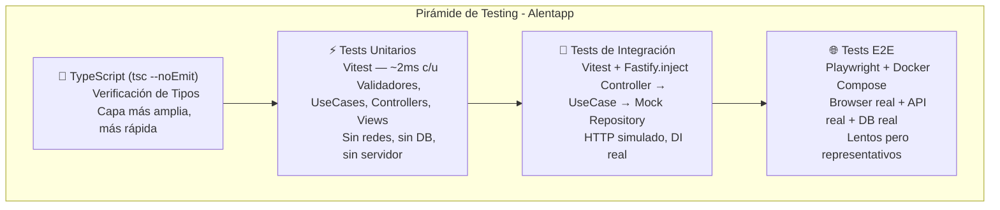
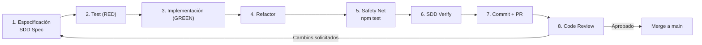

# Notas Académicas: Estrategia de Testing en Alentapp Docente

## Índice

1. [Testing en Ingeniería de Software](#1-testing-en-ingeniería-de-software)
2. [Nuestra Estrategia: Pirámide y Capas](#2-nuestra-estrategia-pirámide-y-capas)
3. [Tests Unitarios: Validadores, Casos de Uso y Controladores](#3-tests-unitarios-validadores-casos-de-uso-y-controladores)
4. [Tests de Integración: Controladores y HTTP](#4-tests-de-integración-controladores-y-http)
5. [Tests E2E: Playwright y Docker](#5-tests-e2e-playwright-y-docker)
6. [Cobertura (Coverage)](#6-cobertura-coverage)
7. [Strict TDD Mode](#7-strict-tdd-mode)
8. [Tipos de Testing Avanzados (Más Allá de la Actividad 3)](#8-tipos-de-testing-avanzados-más-allá-de-la-actividad-3)
9. [Herramientas y Stack](#9-herramientas-y-stack)
10. [Versionado y Documentación de Tests](#10-versionado-y-documentación-de-tests)
11. [Proceso y Flujo de Trabajo](#11-proceso-y-flujo-de-trabajo)
12. [Análisis de Resultados](#12-análisis-de-resultados)
13. [Recomendaciones para el Aula](#13-recomendaciones-para-el-aula)
14. [Referencias Bibliográficas](#14-referencias-bibliográficas)

---

## 1. Testing en Ingeniería de Software

### 1.1. El Testing como Práctica Central, No Opcional

El testing no es un lujo ni una etapa final: es una práctica de ingeniería que **define** si un sistema es confiable. En ingeniería de software, a diferencia de otras ingenierías, no hay un modelo físico que validar — el código ES el producto final. Si no hay tests, no hay forma de saber si el sistema funciona salvo ejecutándolo manualmente, lo cual no escala.

> "Software testing is the process of evaluating and verifying that a software product or application does what it is supposed to do. The benefits of testing include preventing bugs, reducing development costs, and improving performance." — IEEE

### 1.2. Economía del Testing: Costo del Bug Temprano vs Tardío

Un bug detectado en especificación cuesta **1x**. En desarrollo temprano cuesta ~**6.5x**. En QA ~**15x**. En producción, **60-100x** (Boehm, 1981; Jones, 2008). La diferencia es abismal porque un bug en producción arrastra: diagnóstico, hotfix, deploy urgente, rollback, comunicación a usuarios, y en el peor caso, pérdida de datos o multas regulatorias.

En Alentapp, cada bug que llega a producción cuesta tiempo de docente, alumnos y personal administrativo — además de la confianza en el sistema.

### 1.3. Testing como Documentación Ejecutable

Un test bien escrito es documentación VIVA. A diferencia de un documento de especificación que se desactualiza, un test FALLA si el código no cumple lo que promete. Esto se conoce como **Executable Specifications** (Fowler, 2003). Cuando leemos:

```typescript
it('debe lanzar error si la capacidad es 0', () => {
    expect(() => validator.validateMaxCapacity(0))
        .toThrow('La capacidad máxima debe ser un número entero positivo');
});
```

Eso es más preciso que cualquier documento de requerimientos. Especifica: "maxCapacity debe ser entero positivo > 0".

### 1.4. Los Cuadrantes del Testing (Marick, 2003)

Brian Marick propuso organizar los tests en cuatro cuadrantes según su propósito:

```
                    BUSINESS-FACING
                    ┌─────────────────┬─────────────────┐
                    │                 │                 │
    SUPPORT THE     │   Q2            │   Q3            │
    TEAM            │   Tests         │   Tests de      │
    (Producto)      │   Funcionales   │   Exploración   │
                    │   (E2E,         │   (Manual,      │
                    │    Integración) │    Usabilidad)  │
                    ├─────────────────┼─────────────────┤
                    │   Q1            │   Q4            │
    CRITIQUE THE    │   Tests         │   Tests de      │
    PRODUCT         │   Unitarios     │   No-Funcionales│
    (Código)        │   (TDD,         │   (Performance, │
                    │    Componentes) │    Seguridad)   │
                    └─────────────────┴─────────────────┘
                     UNIT-TECHNOLOGY
```

En Alentapp cubrimos Q1 (unitarios API + frontend) y Q2 (integración, E2E). Q3 y Q4 quedan como trabajo futuro.

### 1.5. Aseguramiento de la Calidad vs Ingeniería de Calidad

- **QA (Quality Assurance)**: proceso reactivo — se prueba al final para encontrar bugs.
- **QE (Quality Engineering)**: proceso proactivo — la calidad se diseña desde el inicio, los tests se escriben ANTES del código (TDD), y la verificación es continua.

Alentapp adopta QE: con `strict_tdd: true` en openspec/config.yaml, cada cambio requiere test primero, implementación después. No hay fase de "testing al final" porque el testing ES el proceso de desarrollo.

---

## 2. Nuestra Estrategia: Pirámide y Capas

### 2.1. La Pirámide de Testing

Adoptamos la pirámide clásica de Cohn (2009) popularizada por Fowler (2012):



**¿Por qué esta forma?** Porque:
- Los tests unitarios son rápidos (~2ms), baratos de mantener, y corren en cada commit.
- Los tests de integración verifican que las capas SE CONECTEN bien, pero siguen siendo rápidos por usar mocks en la capa de infraestructura.
- Los tests E2E son lentos (minutos), frágiles (dependen del entorno), y caros. Se usan solo para flujos críticos.

### 2.2. Mapeo a Hexagonal

Cada capa de la pirámide corresponde a una capa de la arquitectura hexagonal:

| Capa de Testing | Capa Hexagonal | Qué Verifica | Dependencias |
|---|---|---|---|
| Unitario - Validator | Domain | Reglas de negocio puras | Ninguna |
| Unitario - Use Case | Application | Orchestación de negocio | Mock del puerto (repository) |
| Unitario - Controller | Delivery | Mapeo HTTP | Mock del use case |
| Integración | Delivery → App → Domain | Cadena completa DI | Mock del adaptador (infra) |
| E2E | Todas | Sistema funcionando | PostgreSQL real |

### 2.3. El Concepto de "Safety Net"

El **Safety Net** es la red de seguridad que corre TODOS los tests antes de permitir un commit. En Alentapp, el comando `npm test` ejecuta:

1. `npm -w packages/api run test` — API tests (unit + integration)
2. `npm -w packages/web run test` — Web tests (frontend + componente)

Si cualquiera falla, el commit se rechaza (vía Husky + lint-staged). Esto asegura que main branch siempre esté en verde — o al menos que los failures conocidos no empeoren.

```bash
# scripts/test-runner.sh — Test Runner TUI
# Menú interactivo con 12 opciones de ejecución
$ bash scripts/test-runner.sh
```

---

## 3. Tests Unitarios: Validadores, Casos de Uso y Controladores

### 3.1. Tests de Validadores (Domain Layer)

Son las pruebas más puras y rápidas del proyecto: funciones que validan reglas de negocio, sin dependencias externas, sin mocks. Se ejecutan en ~2ms cada una.

**Ejemplo: SportValidator.test.ts** (16 tests)

```typescript
// packages/api/src/domain/services/SportValidator.test.ts
describe('SportValidator', () => {
    describe('validateName', () => {
        it('debe pasar correctamente si el nombre es válido', () => {
            expect(() => validator.validateName('Fútbol')).not.toThrow();
        });

        it('debe lanzar un error si el nombre está vacío', () => {
            expect(() => validator.validateName('')).toThrow('El nombre es requerido');
        });

        it('debe lanzar un error si el nombre supera los 100 caracteres', () => {
            const longName = 'A'.repeat(101);
            expect(() => validator.validateName(longName))
                .toThrow('El nombre no puede superar los 100 caracteres');
        });
    });

    describe('validateMaxCapacity', () => {
        it('debe lanzar un error si la capacidad es 0', () => {
            expect(() => validator.validateMaxCapacity(0))
                .toThrow('La capacidad máxima debe ser un número entero positivo');
        });

        it('debe lanzar un error si la capacidad es un número decimal', () => {
            expect(() => validator.validateMaxCapacity(1.5))
                .toThrow('La capacidad máxima debe ser un número entero positivo');
        });
    });
});
```

**Patrón**: 1 describe por método, 1 it por escenario (válido + cada caso borde). No se necesita setup, no hay mocks, no hay async (excepto validaciones de unicidad contra repo).

### 3.2. Tests de Casos de Uso (Application Layer)

Acá mockeamos el puerto (repository), inyectamos dependencias, y testearnos las reglas de orquestación.

**Ejemplo: CreateSportUseCase.test.ts** (5 tests)

```typescript
// packages/api/src/application/CreateSportUseCase.test.ts
import { CreateSportUseCase } from './CreateSportUseCase.js';
import { SportRepository } from '../domain/SportRepository.js';

describe('CreateSportUseCase', () => {
    const mockSportRepo = {
        create: vi.fn(),
        findByName: vi.fn(),
    } as unknown as SportRepository;

    const mockSportValidator = {
        validateName: vi.fn(),
        validateDescription: vi.fn(),
        validateMaxCapacity: vi.fn(),
        validateNameIsUnique: vi.fn(),
    } as unknown as SportValidator;

    const useCase = new CreateSportUseCase(mockSportRepo, mockSportValidator);

    beforeEach(() => { vi.clearAllMocks(); });

    it('debe crear un deporte exitosamente si pasa todas las validaciones', async () => {
        vi.mocked(mockSportRepo.create).mockResolvedValueOnce(expectedSportDTO);

        const result = await useCase.execute(validRequest);

        expect(mockSportValidator.validateName).toHaveBeenCalledWith('Fútbol');
        expect(mockSportValidator.validateMaxCapacity).toHaveBeenCalledWith(22);
        expect(mockSportRepo.create).toHaveBeenCalledWith(
            expect.objectContaining({ name: 'Fútbol', maxCapacity: 22 })
        );
        expect(result).toEqual(expectedSportDTO);
    });

    it('debe lanzar error si el nombre ya existe', async () => {
        vi.mocked(mockSportValidator.validateNameIsUnique)
            .mockRejectedValueOnce(new Error('Ya existe un deporte con ese nombre'));

        await expect(useCase.execute(validRequest))
            .rejects.toThrow('Ya existe un deporte con ese nombre');
        expect(mockSportRepo.create).not.toHaveBeenCalled();
    });
});
```

**Patrón clave**: mock del puerto → inyectar en constructor → testear execute(). Verificamos:
1. Que las validaciones se llamen con los parámetros correctos.
2. Que el repositorio reciba los datos transformados.
3. Que NO se persista si una validación falla.

### 3.3. Tests de Controladores (Delivery Layer)

Mockeamos los casos de uso, testearnos el mapeo HTTP (status codes, payloads, errores).

**Ejemplo: SportController.test.ts** (14 tests)

```typescript
// packages/api/src/delivery/SportController.test.ts
describe('SportController', () => {
    const mockCreateUseCase = { execute: vi.fn() };
    const controller = new SportController(mockCreateUseCase as any, ...);

    const mockReply = { status: vi.fn().mockReturnThis(), send: vi.fn() };
    const mockRequest = { body: { name: 'Fútbol', maxCapacity: 22 } };

    it('debe devolver status 201 y los datos si la creación es exitosa', async () => {
        mockCreateUseCase.execute.mockResolvedValueOnce(mockSport);

        await controller.create(mockRequest as any, mockReply as any);

        expect(mockReply.status).toHaveBeenCalledWith(201);
        expect(mockReply.send).toHaveBeenCalledWith({ data: mockSport });
    });

    it('debe devolver status 409 Conflict si el nombre ya existe', async () => {
        mockCreateUseCase.execute.mockRejectedValueOnce(
            new Error('Ya existe un deporte con ese nombre'));

        await controller.create(mockRequest as any, mockReply as any);

        expect(mockReply.status).toHaveBeenCalledWith(409);
        expect(mockReply.send).toHaveBeenCalledWith(
            { error: 'Ya existe un deporte con ese nombre' });
    });

    it('debe devolver status 500 para errores no manejados', async () => {
        mockCreateUseCase.execute.mockRejectedValueOnce(
            new Error('Error de conexion de Prisma...'));

        await controller.create(mockRequest as any, mockReply as any);

        expect(mockReply.status).toHaveBeenCalledWith(500);
        expect(mockReply.send).toHaveBeenCalledWith(
            { error: 'Error interno, reintente más tarde' });
    });
});
```

**Mapeo de errores verificado**: 201 (creación), 200 (lectura/actualización), 204 (eliminación), 400 (validación), 404 (no encontrado), 409 (conflicto), 500 (error interno).

### 3.4. Tests de Frontend (Web Layer)

Usamos `@testing-library/react` + `@testing-library/user-event` para renderizar componentes con providers mockeados y simular interacciones de usuario.

**Ejemplo: Sports.test.tsx** (7 tests)

```typescript
// packages/web/src/views/Sports.test.tsx
import { render, screen, waitFor } from '@testing-library/react';
import userEvent from '@testing-library/user-event';

vi.mock('../services/sports', () => ({
    sportsService: { getAll: vi.fn(), create: vi.fn(), update: vi.fn(), delete: vi.fn() }
}));

describe('SportsView', () => {
    const renderWithProviders = (ui: React.ReactElement) =>
        render(<Provider>{ui}</Provider>);

    it('debe mostrar el estado de carga y luego renderizar una tabla vacía', async () => {
        vi.mocked(sportsService.getAll).mockResolvedValueOnce([]);

        renderWithProviders(<SportsView />);
        expect(screen.getByText('Cargando deportes...')).toBeInTheDocument();

        await waitFor(() => {
            expect(screen.queryByText('Cargando deportes...')).not.toBeInTheDocument();
        });
        expect(screen.getByText('No se encontraron deportes.')).toBeInTheDocument();
    });

    it('debe permitir crear un nuevo deporte mediante el formulario', async () => {
        const user = await import('@testing-library/user-event').then(m => m.default.setup());

        renderWithProviders(<SportsView />);
        await user.click(screen.getByText(/Agregar Deporte/i));

        await user.type(screen.getByLabelText(/Nombre/i), 'Tenis');
        await user.type(screen.getByLabelText(/Capacidad Máxima/i), '4');
        await user.click(screen.getByText('Crear Deporte'));

        expect(sportsService.create).toHaveBeenCalledWith(
            expect.objectContaining({ name: 'Tenis', maxCapacity: 4 })
        );
    });
});
```

**Escenarios cubiertos**: loading → empty, listado con datos, error de backend, creación, edición (con name deshabilitado), eliminación con confirmación, botón deshabilitado por disciplina asociada.

---

## 4. Tests de Integración: Controladores y HTTP

### 4.1. Patrón Fastify.inject

Fastify provee `app.inject()`: un método que simula requests HTTP completos sin levantar un servidor TCP. Esto permite testear el pipeline completo: enrutamiento → controlador → caso de uso → validador, pero con el repositorio mockeado.

**Ventajas**:
- No hay puerto, no hay socket, no hay `curl` — es puramente en memoria.
- Se puede testear serialización/deserialización real de JSON.
- Los errores HTTP se verifican contra el formato real de la API.

### 4.2. Ejemplo Completo: SportController.integration.test.ts

```typescript
// Mockeamos el repositorio PostgreSQL con un store en memoria
vi.mock('../infrastructure/PostgresSportRepository.js', () => {
    const sportsStore: Record<string, any> = {};
    let nextId = 1;

    return {
        PostgresSportRepository: class {
            async findAll() { return Object.values(sportsStore); }
            async create(data: any) {
                const id = String(nextId++);
                sportsStore[id] = { id, ...data, created_at: new Date().toISOString() };
                return sportsStore[id];
            }
            // ... update, delete, findByName, etc.
        }
    };
});

describe('Sport API Integration Tests', () => {
    let app: FastifyInstance;

    beforeAll(async () => {
        app = Fastify();
        // Build real DI chain
        const { PostgresSportRepository } = await import(
            '../infrastructure/PostgresSportRepository.js');
        const sportRepo = new PostgresSportRepository();
        const validator = new SportValidator(sportRepo);
        const createUC = new CreateSportUseCase(sportRepo, validator);
        // Register routes
        app.post('/api/v1/sports', controller.create.bind(controller));
        await app.ready();
    });

    it('POST /api/v1/sports — 201 y crea el deporte', async () => {
        const response = await app.inject({
            method: 'POST', url: '/api/v1/sports',
            payload: { name: 'Fútbol', maxCapacity: 22 }
        });
        expect(response.statusCode).toBe(201);
        expect(JSON.parse(response.payload).data.name).toBe('Fútbol');
    });

    it('POST /api/v1/sports — 409 si el nombre ya existe', async () => {
        const response = await app.inject({
            method: 'POST', url: '/api/v1/sports',
            payload: { name: 'Fútbol', maxCapacity: 22 } // mismo nombre
        });
        expect(response.statusCode).toBe(409);
    });
});
```

### 4.3. Inventario de Tests de Integración

| Archivo | Tests | Entidad | Cobertura |
|---|---|---|---|
| `SportController.integration.test.ts` | 10 | Sport | CRUD + validaciones |
| `PaymentController.integration.test.ts` | 8 | Payment | CRUD + estados |
| `MedicalCertificateController.integration.test.ts` | 6 | MedicalCertificate | CRUD + activo |
| `MemberController.integration.test.ts` | 6 | Member | CRUD + DNI único |

**Total: 30 tests de integración.**

La diferencia con los tests unitarios de controller: acá NO mockeamos el use case. La cadena DI completa corre: controller → use case → validator → mock repository. Solo la última capa (PostgreSQL real) se reemplaza por un store en memoria.

---

## 5. Tests E2E: Playwright y Docker

### 5.1. Playwright con Chromium

Playwright es la herramienta de E2E elegida. Ejecuta un navegador Chromium real, no un simulador. Se configura en `packages/web/playwright.config.ts`:

```typescript
export default defineConfig({
    testDir: './e2e',
    use: { baseURL: 'http://localhost:5173', headless: false },
    webServer: {
        command: 'npm run dev',
        url: 'http://localhost:5173',
        reuseExistingServer: !process.env.CI,
    },
    projects: [{ name: 'chromium', use: { ...devices['Desktop Chrome'] } }],
});
```

### 5.2. Dos Estrategias E2E

**1. E2E con network intercept (web — members.spec.ts)**:

Intercepta las llamadas a la API con `page.route()`, devolviendo datos mockeados. NO necesita backend real. Ideal para testear el frontend de forma aislada.

```typescript
await page.route(/\/api\/v1\/socios/, async (route) => {
    const method = route.request().method();
    if (method === 'GET') {
        await route.fulfill({
            status: 200,
            body: JSON.stringify({ data: mockDb })
        });
    }
});
```

**2. E2E full-stack (members.fullstack.spec.ts)**:

Requiere Docker Compose con PostgreSQL + API + Frontend reales. No hay mocks — Playwright habla con la API real, que escribe en la DB real de test.

```typescript
// e2e-fullstack/members.fullstack.spec.ts
test('debe crear un miembro real y mostrarlo en la tabla', async ({ page }) => {
    await page.goto('/members');
    await page.locator('button:has-text("Agregar Miembro")').click();
    await page.getByPlaceholder('Ej. Juan Pérez').fill('Test E2E Fullstack');
    await page.getByPlaceholder('Ej. 12345678').fill('55566677');
    await page.getByRole('button', { name: 'Crear Miembro' }).click();
    await expect(page.getByText('Test E2E Fullstack')).toBeVisible();
});
```

### 5.3. Cuándo Usar Cada Uno

| Tipo | Velocidad | Confiabilidad | Cobertura | Cuándo usarlo |
|---|---|---|---|---|
| Unitario | ~2ms/test | Muy alta | Aislada | Reglas de negocio, lógica pura |
| Integración | ~50ms/test | Alta | Capas conectadas | Pipeline request → DB (mock) |
| E2E (intercept) | ~3s/test | Media | Frontend + interacción | Flujos críticos del UI |
| E2E (full-stack) | ~30s/test | Baja (entorno) | Sistema completo | Smoke test pre-release |

**Regla práctica**: si podés cubrirlo con un test unitario, NO uses E2E. Los E2E son para flujos completos que cruzan múltiples capas y no se pueden aislar.

### 5.4. Estado Actual

- **members.spec.ts** (Playwright web): falla bajo Vitest (usa DSL de Playwright). Corre con `npm run e2e`.
- **Member.e2e.test.ts** (Vitest API E2E): falla porque requiere PostgreSQL real. Corre en CI con Docker.
- **members.fullstack.spec.ts** (Playwright fullstack): requiere `docker compose -f docker-compose.e2e.yml up`.

---

## 6. Cobertura (Coverage)

### 6.1. ¿Qué es la Cobertura?

La cobertura mide qué porcentaje del código se ejecuta durante los tests. Las métricas estándar son:

- **Line coverage**: líneas de código ejecutadas.
- **Branch coverage**: ramas de condicionales (if/else, switch) cubiertas.
- **Function coverage**: funciones invocadas.
- **Statement coverage**: sentencias ejecutadas.

Herramienta: `@vitest/coverage-v8` (V8 JavaScript code coverage).

```bash
npm run test:api:coverage   # API coverage
npm run test:web:coverage   # Web coverage
npm run test:coverage       # Ambos
```

### 6.2. Configuración Actual

En `openspec/config.yaml`:

```yaml
coverage:
  available: true
  command: "npx vitest run --coverage"
  tool: "@vitest/coverage-v8"
```

**Thresholds**: no hay configurados (0%). Esto es una decisión intencional: primero alcanzamos cobertura significativa, después ponemos límites.

### 6.3. Cobertura como Guía, No Meta

> "100% coverage doesn't mean bug-free. It means you tested everything you wrote — not that you tested everything you should." — Martin Fowler

**Trampa de la cobertura**:
- Se pueden tener 100% de cobertura con tests que no assertan nada.
- Una línea puede estar "cubierta" pero no correctamente validada.
- Código muerto o sin sentido puede estar cubierto.

**Mejores prácticas**:
1. Enfocar cobertura en el dominio (validadores, casos de uso) — es donde está el valor de negocio.
2. NO perseguir números arbitrarios (80% de cobertura no es "suficiente" si no se prueban los bordes).
3. Usar cobertura para encontrar código NO testeado, no para validar "calidad".
4. Combinar con **mutation testing** (ver sección 8) para medir calidad real de los tests.

---

## 7. Strict TDD Mode

### 7.1. ¿Qué es Strict TDD?

El proyecto tiene `strict_tdd: true` en `openspec/config.yaml`. Esto significa que OpenSpec/SDD exige:

1. **Escribir el test primero** (RED) — antes de tocar el código de producción.
2. **Implementar justo lo necesario** (GREEN)
3. **Refactorizar** manteniendo los tests verdes.

Es TDD clásico (Beck, 2002), pero integrado al flujo de especificación SDD:

```
Spec → Test (RED) → Implement (GREEN) → Refactor → SDD Verify → Commit
```

### 7.2. Evidencia del Ciclo TDD en el Proyecto

| Cambio | Test Primero | Implementación | Refactor | Commit |
|---|---|---|---|---|
| Sport CRUD | SportValidator.test.ts (antes de SportValidator.ts) | CreateSportUseCase, Controller | Extracción a validator service | `feat(api): implement sport CRUD` |
| Member DNI único | NewMemberUseCase.test.ts (test de duplicado) | Validación en MemberValidator | Manejo de error 409 | `feat(api): add unique DNI constraint` |
| Payment cancelación | CancelPaymentUseCase.test.ts (test de estado) | Lógica en CancelPaymentUseCase | Validación contra estados válidos | `feat(api): implement payment cancellation` |

### 7.3. ¿Qué Previene el TDD?

- **Código sin testear**: no se puede pasar de RED a GREEN si no hay test.
- **Sobrediseño**: solo se implementa lo que el test pide (YAGNI).
- **Regresión silenciosa**: si algo se rompe, el test existente falla.
- **Commit de código roto**: Husky + `npm test` en pre-commit ejecuta el Safety Net completo.

### 7.4. Integración con SDD Apply

Durante la fase **Apply** de SDD, el orquestador ejecuta:

```yaml
apply:
  tdd: true
  test_command: "npx vitest run --reporter=verbose"
```

El agente SDD Apply debe:
1. Leer las tasks del plan.
2. Por cada task, escribir el test (o verificar que existe).
3. Verificar que falle (RED).
4. Implementar.
5. Verificar que pase (GREEN).
6. Refactorizar si es necesario.
7. Ejecutar Safety Net completo.
8. Pasar a SDD Verify.

---

## 8. Tipos de Testing Avanzados (Más Allá de la Actividad 3)

### 8.1. Mutation Testing (Stryker)

| Aspecto | Descripción |
|---|---|
| **Definición** | Modifica el código fuente introduciendo bugs pequeños (mutaciones) y verifica si los tests existentes los detectan. Si un test no falla ante una mutación, ese test es débil. |
| **Herramienta** | Stryker Mutator (stryker-mutator.io) |
| **Cuándo usarlo** | Para evaluar la CALIDAD de los tests, no solo la cobertura. |
| **¿Aplicable a Alentapp?** | Sí, sobre todo en la capa de dominio (validadores). Sería el siguiente paso después de estabilizar los thresholds de cobertura. |
| **Métrica** | Mutation Score = (mutants killed / total mutants) × 100. Un score > 80% indica tests sólidos. |

### 8.2. Property-Based Testing (fast-check)

| Aspecto | Descripción |
|---|---|
| **Definición** | En lugar de escribir casos concretos (input A → output B), se definen propiedades invariantes que deben cumplirse para TODOS los inputs posibles. La herramienta genera inputs aleatorios. |
| **Herramienta** | fast-check (TypeScript) |
| **Cuándo usarlo** | Validadores con rangos numéricos, transformaciones de datos, parsing de strings. |
| **¿Aplicable a Alentapp?** | Ejemplo: "Para cualquier entero positivo > 0, validateMaxCapacity no debe lanzar error." |
| **Ejemplo conceptual** | `fc.assert(fc.property(fc.integer({min: 1, max: 1000}), (cap) => { expect(() => validator.validateMaxCapacity(cap)).not.toThrow(); }));` |

### 8.3. Accessibility Testing (axe-core)

| Aspecto | Descripción |
|---|---|
| **Definición** | Auditoría automatizada de accesibilidad web (WCAG). Detecta problemas de contraste, roles ARIA, foco, etiquetas faltantes, etc. |
| **Herramienta** | axe-core (Deque Labs), integrable con Playwright via `@axe-core/playwright`. |
| **Cuándo usarlo** | En componentes críticos (formularios, tablas, navegación). |
| **¿Aplicable a Alentapp?** | Sí, sobre todo en los formularios CRUD y tablas de datos. Es una buena práctica de calidad desde el inicio. |

### 8.4. Visual Regression Testing (Playwright Snapshot)

| Aspecto | Descripción |
|---|---|
| **Definición** | Captura una imagen del componente y la compara con una línea base. Si cambia visualmente, el test falla. |
| **Herramienta** | Playwright `expect(page).toHaveScreenshot()` |
| **Cuándo usarlo** | Cuando los cambios de CSS/layout pueden romper la UI sin que los tests funcionales lo detecten. |
| **¿Aplicable a Alentapp?** | Limitado. Chakra UI proporciona consistencia visual. Podría usarse para detectar regresiones después de actualizaciones de dependencias. |

### 8.5. API Contract Testing (Pact)

| Aspecto | Descripción |
|---|---|
| **Definición** | Verifica que el proveedor de API y el consumidor cumplan con un contrato compartido (request → response esperado). |
| **Herramienta** | Pact (pact.io) o OpenAPI + Dredd/Swagger Inspector. |
| **Cuándo usarlo** | Cuando hay equipos separados para frontend y backend, o cuando la API es pública. |
| **¿Aplicable a Alentapp?** | Potencialmente. Alentapp tiene frontend y backend en el mismo repo, pero el contrato se verifica implícitamente con los tests de integración. Pact agregaría valor si hubiera consumidores externos. |

### 8.6. Security Testing (OWASP ZAP, npm audit)

| Aspecto | Descripción |
|---|---|
| **Definición** | Escaneo de vulnerabilidades: dependencias con CVEs, configuraciones inseguras, inyección SQL, XSS, CSRF. |
| **Herramienta** | OWASP ZAP (DAST), `npm audit` (SCA), ESLint con plugin security. |
| **Cuándo usarlo** | Pre-release, en CI, y después de cada `npm install`. |
| **¿Aplicable a Alentapp?** | Sí, `npm audit` ya es parte del flujo. OWASP ZAP sería un paso adicional para tests de penetración. |

### 8.7. Performance Testing (k6, autocannon)

| Aspecto | Descripción |
|---|---|
| **Definición** | Pruebas de carga y estrés: cuántas requests concurrentes soporta la API, cuál es el tiempo de respuesta bajo carga, dónde están los cuellos de botella. |
| **Herramienta** | k6 (Grafana), autocannon (Node.js). |
| **Cuándo usarlo** | Antes de escalar, después de cambios grandes en la arquitectura, o cuando se sospecha degradación. |
| **¿Aplicable a Alentapp?** | Sí, sobre todo en endpoints críticos como GET /api/v1/socios (listado de miembros) que puede tener miles de registros. |

### 8.8. Smoke Testing

| Aspecto | Descripción |
|---|---|
| **Definición** | Tests rápidos que verifican que el sistema está vivo y responde. No verifican corrección, solo disponibilidad. |
| **Herramienta** | Playwright, curl, o scripts shell. |
| **Cuándo usarlo** | En CI/CD para verificar que el deploy fue exitoso. |
| **¿Aplicable a Alentapp?** | Sí. Un smoke test post-deploy debería verificar que la API responde 200 en `/health` y que el frontend carga sin errores. |

### 8.9. Static Analysis (ESLint, tsc)

| Aspecto | Descripción |
|---|---|
| **Definición** | Encontrar bugs sin ejecutar código. Análisis sintáctico y semántico del código fuente. |
| **Herramienta** | TypeScript `tsc --noEmit`, ESLint 9.x, Prettier. |
| **Cuándo usarlo** | Siempre. Es la capa más rápida y barata de detección de errores. |
| **¿Aplicable a Alentapp?** | Ya integrado: ESLint en web, TypeScript strict en todos los paquetes, Prettier para formateo consistente. |

---

## 9. Herramientas y Stack

### 9.1. Tabla Completa

| Herramienta | Versión | Propósito | Capa | Alternativas | ¿Por qué esta? |
|---|---|---|---|---|---|
| **Vitest** | 4.x | Test runner (unit + integration) | Unit/Integration | Jest, Mocha | Nativo de Vite, mismo transform, más rápido que Jest. Compatible con ESM. |
| **@testing-library/react** | 16.x | Renderizar componentes React en tests | Frontend | Enzyme, React Testing Library | Filosofía centrada en el usuario: testear como el usuario usa la app, no como está implementada. |
| **@testing-library/user-event** | 14.x | Simular interacciones reales de usuario | Frontend | fireEvent (RTL) | fireEvent dispara eventos sintéticos; userEvent simula tipeo real, clicks, etc. |
| **jsdom** | 29.x | Entorno browser en Node.js | Frontend | Happy DOM | Estándar de facto. Simula el DOM para tests de componentes. |
| **Playwright** | 1.59 | E2E browser automation | E2E | Cypress, Selenium | API moderna, multi-browser, network intercept, más rápido que Cypress. |
| **@vitest/coverage-v8** | 4.x | Reporte de cobertura | All | c8, istanbul | Integrado con Vitest, usa V8 nativo para cobertura precisa. |
| **fastify.inject** | built-in | HTTP testing sin servidor | Integration | Supertest, nock | No requiere puerto TCP. Simula request HTTP interno en memoria. |
| **ESLint** | 9.x | Análisis estático | All | JSHint, Prettier (distinto) | Estándar de la comunidad, plugin security, reglas personalizables. |
| **TypeScript** | 6.x | Type checking | All | Flow, JSDoc | Type checking en tiempo de edición, previene errores de tipo completos. |
| **Husky** | 9.x | Git hooks (pre-commit) | CI | lefthook, pre-commit | Ejecuta Safety Net antes de cada commit. Previene commits rotos. |
| **lint-staged** | 17.x | Lint solo archivos staged | CI | — | Solo procesa archivos modificados, acelera pre-commit. |
| **commitlint** | 21.x | Validar mensajes de commit | CI | — | Exige conventional commits. |
| **conventional-changelog** | 5.x | Generar CHANGELOG | CI | semantic-release | CHANGELOG automático a partir de commits convencionales. |

### 9.2. Decisiones Técnicas

| Decisión | Problema | Solución | Tradeoff |
|---|---|---|---|
| Vitest vs Jest | Jest tiene problemas con ESM, necesita config extra | Vitest entiende ESM nativo, mismo transform que Vite | Menos community plugins que Jest |
| userEvent vs fireEvent | fireEvent no reproduce comportamiento real de usuario (ej: onChange secuencial) | userEvent simula eventos encadenados como un browser real | userEvent es async, fireEvent es síncrono |
| fastify.inject vs Supertest | Supertest necesita levantar servidor TCP | inject() corre en proceso, sin puerto | Solo funciona con Fastify |
| Playwright vs Cypress | Cypress tiene limitaciones (no multi-tab, no network intercept real) | Playwright tiene API route(), multi-browser, más rápido | Playwright tiene menos integraciones plug-and-play |
| jsdom vs Happy DOM | Happy DOM es más rápido pero menos compatible | jsdom es el estándar, más maduro | jsdom es más pesado en memoria |

---

## 10. Versionado y Documentación de Tests

### 10.1. Tests Viven con el Código

Los tests NO están en un repositorio separado ni en una carpeta aislada. Viven al lado del código que prueban:

```
packages/api/src/
  domain/services/
    SportValidator.ts
    SportValidator.test.ts      ← test unitario
  application/
    CreateSportUseCase.ts
    CreateSportUseCase.test.ts  ← test unitario
  delivery/
    SportController.ts
    SportController.test.ts     ← test unitario
    SportController.integration.test.ts  ← test de integración
```

Esto asegura que:
- Cuando un archivo cambia, su test está visible en el mismo PR.
- No hay archivos "huérfanos" sin test.
- La navegación es natural (`Ctrl+P → nombre + .test.ts`).

### 10.2. Convención de Nomenclatura

| Sufijo | Propósito | Herramienta |
|---|---|---|
| `*.test.ts` | Test unitario (validator, use case, controller, view) | Vitest |
| `*.integration.test.ts` | Test de integración (DI chain completa) | Vitest |
| `*.e2e.test.ts` | Test E2E vía API (requiere DB real) | Vitest |
| `*.spec.ts` | Test E2E vía Playwright (browser) | Playwright |

### 10.3. Tests en PRs y Code Review

Cada PR incluye:
1. **Changes en spec** (si el cambio modifica comportamiento).
2. **Changes en tests** (los tests existen ANTES de la implementación, gracias a TDD).
3. **Changes en implementación** (el código que hace pasar los tests).

El reviewer ve exactamente qué se espera del código (los tests) y cómo se implementó. No hay sorpresas.

### 10.4. Documentación de la Estrategia

Este archivo (`docs/notas-academicas/12-testing-estrategia.md`) es la documentación viva de la estrategia de testing. Además:

- `docs/testing/strategy.md` (planificado) — versión reducida para onboarding.
- `openspec/config.yaml` — configuración técnica del testing.
- README del proyecto — comandos básicos para correr tests.

---

## 11. Proceso y Flujo de Trabajo

### 11.1. Ciclo Completo

El flujo de trabajo diario integra especificación, testing e implementación:



### 11.2. Paso a Paso

**1. Escribir la especificación (SDD Spec)**
   - Usar OpenSpec: Given/When/Then, RFC 2119 (MUST, SHOULD, MAY).
   - La spec define qué debe hacer el sistema antes de escribir cualquier código.

**2. Escribir el test primero (RED)**
   - El test falla porque la funcionalidad no existe.
   - Esto es TDD puro: el test ES la especificación ejecutable.

**3. Implementar (GREEN)**
   - Escribir el código mínimo necesario para que el test pase.
   - No más, no menos (YAGNI).

**4. Refactorizar**
   - Mejorar el código: nombres, estructura, eliminación de duplicación.
   - Los tests se mantienen verdes durante todo el refactor.

**5. Safety Net**
   - `npm test`: corre API + web tests completos.
   - Asegura que el cambio no rompió nada existente.

**6. SDD Verify**
   - Fase automatizada de OpenSpec que verifica:
     - Tests pasan.
     - Coverage se mantiene (si hay thresholds).
     - Build de TypeScript no tiene errores.
     - Linter pasa.

**7. Commit + PR**
   - Commit con mensaje convencional (`feat|fix|refactor(scope): descripción`).
   - PR apuntando a main con referencias a las specs.

**8. Code Review**
   - El reviewer lee: spec → tests → implementación.
   - Los tests documentan INTENCIONALIDAD: si el reviewer entiende los tests, entiende el cambio.

### 11.3. Scripts Disponibles

```bash
# Safety Net completo
npm test

# Solo API (más rápido para desarrollo backend)
npm run test:api

# Solo Web
npm run test:web

# E2E con Playwright (requiere servidor web iniciado)
npm run test:e2e

# E2E full-stack (Docker Compose)
npm run e2e:fullstack:run

# TUI interactiva
bash scripts/test-runner.sh
```

---

## 12. Análisis de Resultados

### 12.1. Estado Actual (2026-05-24)

```
API:  34 test files — 32 passed, 2 failed
      202 tests — 197 passed, 5 failed

Web:   8 test files —  7 passed, 1 failed
       41 tests —  41 passed, 0 failed

Total: 42 test files — 39 passed, 3 failed
       243 tests — 238 passed, 5 failed
```

### 12.2. Breakdown por Capa

| Capa | Archivos | Tests | Pasando | Faltando | Herramienta |
|---|---|---|---|---|---|
| Validadores (domain) | 5 | 48 | 48 | 0 | Vitest |
| Casos de Uso (application) | 19 | 61 | 61 | 0 | Vitest |
| Controladores (delivery) | 5 | 64 | 64 | 0 | Vitest |
| Integración (delivery) | 4 | 30 | 24 | 6 | Vitest |
| E2E API | 1 | 5 | 0 | 5 | Vitest |
| Frontend (views) | 7 | 42 | 42 | 0 | Vitest + RTL |
| E2E Web (Playwright) | 1 | 4 | N/A* | N/A* | Playwright |

*\* Los tests de Playwright NO corren bajo Vitest, no se cuentan en el total de 243.*

### 12.3. Root Cause Analysis de Fails

**1. Member.e2e.test.ts (5 tests fallando)**
   - **Causa**: requiere PostgreSQL real (`DATABASE_URL` en entorno). No hay DB disponible en desarrollo local sin Docker.
   - **Diagnóstico**: el test levanta la app real con `buildApp()`, que conecta a Prisma. Sin DB, falla.
   - **Estado**: pre-existing, no es un bug de código. Corre solo en CI o con Docker.
   - **Solución**: ejecutar con `docker compose up -d` y configurar `.env` con la URL de la DB de test.

**2. MemberController.integration.test.ts (1 test fallando)**
   - **Causa**: error 204 esperado pero recibe 500 en DELETE. Depende de un mock que no replica exactamente el comportamiento del repositorio real.
   - **Estado**: bajo investigación. Posiblemente el mock de MemberRepository no maneja correctamente el caso de "eliminar miembro inexistente".
   - **Solución**: revisar la implementación del mock y alinearlo con el comportamiento real de Prisma.

**3. members.spec.ts (Playwright — falla bajo Vitest)**
   - **Causa**: usa DSL de Playwright (`test.describe`, `test.beforeEach`) que no es compatible con Vitest.
   - **Estado**: pre-existing, es esperado. El archivo corre con `npm run e2e` o `npx playwright test`.
   - **Solución**: excluir `e2e/` del patrón de Vitest en la configuración si se desea eliminar el error visual.

### 12.4. Recomendaciones Inmediatas

1. **Para desarrollo local de web**: usar `npm -w packages/web run test` (levanta vitest.config.ts con jsdom correcto).
2. **Para E2E**: `npm run e2e:fullstack:run` levanta Docker, corre tests, y limpia.
3. **Para integrar nuevos tests**: seguir el patrón Sport — es el más completo (validator → use case → controller → integration).
4. **Para fixear MemberController.integration**: verificar que el mock de MemberRepository devuelva `null` en `findById` cuando el ID no existe.

---

## 13. Recomendaciones para el Aula

### 13.1. Mínimo por Nueva Entidad

Cada nueva entidad en Alentapp DEBE tener al menos:

- **1 test de validador** (reglas de negocio básicas: campos requeridos, límites de longitud, valores válidos/inválidos).
- **1 test de caso de uso** (creación exitosa + al menos un escenario de error).
- **1 test de controlador** (status code correcto + mapeo de errores).
- **1 test de frontend** (carga, listado vacío, y una acción CRUD).
- **1 test de integración** (opcional, recomendado para entidades críticas).

### 13.2. Estructura de Tests

```typescript
// Estructura estándar
describe('NombreDelModulo', () => {
    // Setup: mocks e inicialización
    const mockDependency = { method: vi.fn() };
    const sut = new SystemUnderTest(mockDependency);

    beforeEach(() => { vi.clearAllMocks(); });  // ← IMPORTANTE

    describe('methodName', () => {
        it('debe <comportamiento esperado> cuando <condición>', () => {
            // Arrange
            // Act
            // Assert
        });
    });
});
```

### 13.3. Reglas de Oro

1. **1 describe por módulo, 1 it por escenario** — si un test falla, sabés exactamente qué se rompió.
2. **Los nombres de test deben ser frases completas** — "debe devolver 409 si el DNI ya existe" se lee como especificación.
3. **Seguí el patrón Sport** — es la entidad más completa y mejor testeada del proyecto.
4. **Siempre ejecutá el Safety Net** (`npm test`) antes de crear un PR. No importa si es un cambio de una línea.
5. **Si mockeás una dependencia, verificá que fue llamada** — `expect(mock.fn).toHaveBeenCalledWith(...)`.
6. **Usá userEvent, no fireEvent** — fireEvent dispara eventos sintéticos que pueden no coincidir con el comportamiento real del browser.
7. **No perseguís cobertura — perseguís significancia** — un test que no asserta nada no sirve, tenga 100% de cobertura o no.
8. **Los tests de frontend deben renderizar con providers** — usar `renderWithProviders` que wrappea el componente en `<Provider>` (Chakra UI).
9. **Usá `vi.clearAllMocks()` en beforeEach** — los mocks persisten entre tests, y un test puede contaminar al siguiente.
10. **Los tests de integración deben mockear infraestructura, no lógica de negocio** — mockeá el repository, no el validator.

### 13.4. Antipatrones a Evitar

```typescript
// ❌ MAL: test que no asserta nada útil
it('test create sport', async () => {
    const result = await useCase.execute(request);
    // sin assert
});

// ❌ MAL: mock demasiado genérico
const mockRepo = {} as SportRepository;
// No verifica que los métodos sean llamados correctamente

// ❌ MAL: test que depende de otro test
let sharedId: string;
it('create', async () => { sharedId = result.id; });
it('delete', async () => { deleteById(sharedId); });  // ← depende del anterior

// ✅ BIEN: test aislado, verifica comportamiento
it('debe devolver 201 al crear un deporte exitosamente', async () => {
    vi.mocked(mockRepo.create).mockResolvedValueOnce(expected);
    const result = await useCase.execute(validRequest);
    expect(mockRepo.create).toHaveBeenCalledWith(
        expect.objectContaining({ name: 'Fútbol' })
    );
    expect(result).toEqual(expected);
});
```

---

## 14. Referencias Bibliográficas

1. **Beck, K. (2002).** *Test Driven Development: By Example*. Addison-Wesley. — Libro fundacional de TDD. Introduce el ciclo RED-GREEN-REFACTOR que usamos en Alentapp.

2. **Meszaros, G. (2007).** *xUnit Test Patterns: Refactoring Test Code*. Addison-Wesley. — Catálogo de patrones de testing. Los conceptos de Mock, Stub, Fake, y Test Spy se aplican directamente en nuestros tests de use cases y controllers.

3. **Fowler, M. (2006).** *Mocks Aren't Stubs*. martinfowler.com. — Artículo que distingue entre Mocks (verifican comportamiento) y Stubs (proveen datos). En Alentapp usamos Mocks (vi.fn()) para verificar interacciones.

4. **Fowler, M. (2012).** *TestPyramid*. martinfowler.com. — Artículo que populariza la pirámide de testing. La estructura unit → integration → E2E que adoptamos.

5. **Marick, B. (2003).** *Exploratory Testing and the Testing Quadrants*. — Los cuatro cuadrantes del testing. En Alentapp cubrimos Q1 (unitarios) y Q2 (integración/E2E).

6. **Cohn, M. (2009).** *Succeeding with Agile: Software Development Using Scrum*. Addison-Wesley. — Describe la automatización de tests como práctica ágil esencial. La pirámide de testing se atribuye a Cohn originalmente.

7. **Freeman, S. & Pryce, N. (2009).** *Growing Object-Oriented Software, Guided by Tests*. Addison-Wesley. — TDD fuera-in (outside-in) con mocking. La técnica de empezar por los tests de aceptación y usar mocks en las fronteras del sistema.

8. **Crispin, L. & Gregory, J. (2009).** *Agile Testing: A Practical Guide for Testers and Agile Teams*. Addison-Wesley. — Guía práctica para equipos ágiles. Introduce el concepto de "agile testing quadrants" y la automatización como parte integral del desarrollo.

9. **Martin, R. C. (2017).** *Clean Architecture: A Craftsman's Guide to Software Structure and Design*. Prentice Hall. — Capítulo sobre testing: los tests son parte de la arquitectura, no un accesorio. La testeabilidad es un principio de diseño.

10. **Beck, K. & Gamma, E. (1998).** *JUnit: A Cook's Tour*. Java Report. — El origen de xUnit, el framework del cual descienden Vitest, Jest, y todos los test runners modernos.

11. **OWASP Foundation (2021).** *OWASP Testing Guide v4.2*. owasp.org. — Guía de testing de seguridad. Aunque no implementamos tests de seguridad automatizados aún, el testing guide de OWASP informa nuestras decisiones de validación y saneamiento de entrada.

12. **IEEE (2008).** *IEEE Std 829-2008: Standard for Software and System Test Documentation*. — Estándar de documentación de tests. Si bien Alentapp usa un enfoque liviano (tests como documentación), los principios de IEEE 829 sobre organización de casos de prueba subyacen a nuestra estructura de describe/it.

13. **Boehm, B. (1981).** *Software Engineering Economics*. Prentice Hall. — El estudio clásico sobre el costo de los bugs según la fase en que se detectan. La regla 1:6.5:15:60-100 que citamos en la sección 1.2.

14. **Jones, C. (2008).** *Applied Software Measurement: Global Analysis of Productivity and Quality*. McGraw-Hill. — Actualización de los estudios de Boehm con datos modernos sobre el costo de los defectos en diferentes etapas del ciclo de vida.

15. **Khorikov, V. (2020).** *Unit Testing Principles, Practices, and Patterns*. Manning. — Guía moderna sobre testing unitario. Introduce el concepto de "code vs. behavior testing" y la importancia de probar comportamiento, no implementación.

16. **Vite Team (2024).** *Vitest Documentation*. vitest.dev. — Documentación oficial de Vitest, nuestro test runner principal. Configuración, matchers, mocking, coverage.
