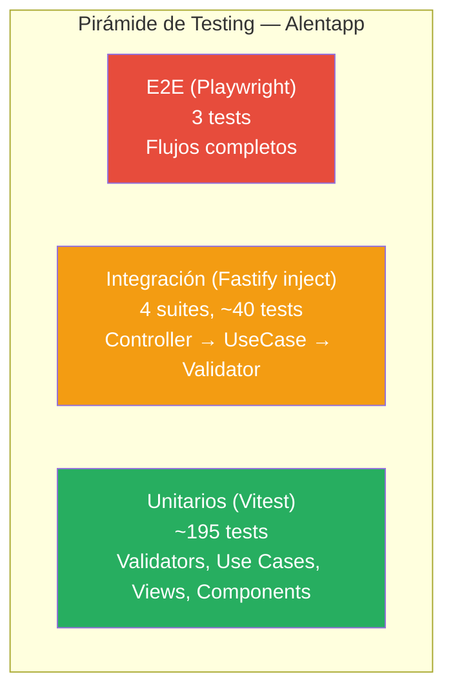

# Estrategia de Testing — Alentapp Docente

## 1. Introducción y Objetivos

El testing es una parte fundamental del desarrollo de software. No es un adicional ni un lujo: es la única manera de tener confianza en que el código hace lo que tiene que hacer, y de que seguirá haciéndolo cuando alguien lo modifique. En un proyecto académico como Alentapp Docente, donde múltiples alumnes trabajan sobre la misma base de código, una estrategia de testing sólida es **obligatoria**, no opcional.

Este documento describe la estrategia de testing completa del proyecto. Cubre:

- La **pirámide de testing** y cómo se aplica acá
- Qué tests existen, qué cubren y qué **no** cubren
- Patrones concretos con código real del proyecto
- Herramientas: Vitest 4, Testing Library, Playwright
- Tipos de testing más allá de lo requerido en la actividad (mutación, propiedades, accesibilidad, etc.)
- Automatización, scripts y cómo correr las suites
- Estado actual: 238 tests, 197 pasando, 41 fallas preexistentes
- Recomendaciones para alumnes

> **Objetivo principal**: que cualquier persona que abra el proyecto entienda qué tests hay, por qué están organizados así, y cómo agregar nuevos tests sin romper lo existente.

---

## 2. Pirámide de Testing

La pirámide clásica de testing (Mike Cohn, 2009) dicta que deberíamos tener **muchos tests unitarios**, **algunos tests de integración** y **pocos tests E2E**. Este proyecto no es la excepción.



### 2.1. Base: Tests Unitarios

Son la base de la pirámide. Rápidos, deterministas, sin E/S. Cubren:

- **Validators** (`domain/services/`): lógica de validación pura, sin mocks
- **Use Cases** (`application/`): orquestación con puertos mockeados
- **Controllers** (`delivery/`): mapeo HTTP con casos de uso mockeados
- **Views** (`web/src/views/`): componentes React con servicios mockeados
- **Components** (`web/src/components/`): componentes puros con providers

### 2.2. Medio: Tests de Integración

Validan que el wiring entre capas funcione. Usan `app.inject()` de Fastify para enviar requests HTTP reales a una instancia de la aplicación sin levantar un servidor. El repositorio se mockea, pero el flujo Controller → UseCase → Validator es real.

### 2.3. Punta: Tests E2E

Usan Playwright con un navegador real. Hay dos modalidades:

- **E2E con mocks de red** (`packages/web/e2e/`): rápidos, no requieren backend
- **E2E Full-Stack** (`e2e-fullstack/`): Docker + PostgreSQL + API real + navegador

---

## 3. Tests Unitarios

### 3.1. Validators (`domain/services/`)

**Qué se testea**: Cada método de validación de forma aislada. Reglas de negocio puras: formato de email, rangos de capacidad, unicidad de nombre, fechas, etc.

**Qué NO se testea**: La lógica del repositorio (eso es responsabilidad del test de integración).

**Patrón**: Función pura → entrada → salida. Sin mocks (salvo cuando el validador depende del repositorio para validar unicidad). Usan `describe`/`it` con `expect(() => ...).toThrow()`.

**Ejemplo real** — `SportValidator.test.ts`:

```typescript
describe('SportValidator', () => {
    describe('validateName', () => {
        it('debe pasar correctamente si el nombre es válido', () => {
            expect(() => validator.validateName('Fútbol')).not.toThrow();
            expect(() => validator.validateName('Natación')).not.toThrow();
        });

        it('debe lanzar un error si el nombre está vacío', () => {
            expect(() => validator.validateName('')).toThrow('El nombre es requerido');
            expect(() => validator.validateName('   ')).toThrow('El nombre es requerido');
        });
    });

    describe('validateMaxCapacity', () => {
        it('debe lanzar un error si la capacidad es 0', () => {
            expect(() => validator.validateMaxCapacity(0))
                .toThrow('La capacidad máxima debe ser un número entero positivo');
        });
    });
});
```

Cuando el validador necesita el repositorio (validación de unicidad), se mockea el puerto:

```typescript
describe('validateNameIsUnique', () => {
    it('debe pasar si el nombre no existe en la base de datos', async () => {
        vi.mocked(mockSportRepo.findByName).mockResolvedValueOnce(null);
        await expect(validator.validateNameIsUnique('Fútbol')).resolves.not.toThrow();
    });
});
```

**Inventario de Validators**:

| Archivo | Entidad | Métodos testeados | Líneas |
|---|---|---|---|
| `SportValidator.test.ts` | Sport | validateName, validateDescription, validateMaxCapacity, validateNameIsUnique, validateNameNotInPayload | 107 |
| `MemberValidator.test.ts` | Member | validateEmail, isMinor, validateDniIsUnique | 68 |
| `DisciplineValidator.test.ts` | Discipline | validateEndDate, validateSportExists | 57 |
| `PaymentValidator.test.ts` | Payment | validateAmount, validatePaymentType, validateCancel, validateDateRange | 88 |
| `MedicalCertificateValidator.test.ts` | MedicalCertificate | validateExpirationDate | 25 |

### 3.2. Use Cases (`application/`)

**Qué se testea**: La orquestación completa de un caso de uso — validaciones, reglas de negocio, persistencia. Se mockean los puertos (repositorios) y los validators.

**Qué NO se testea**: La implementación del repositorio (eso es infraestructura) ni el mapeo HTTP (eso es delivery).

**Patrón**: **Mock del puerto + Mock del validador + Inyección por constructor + Test de flujo feliz y flujos de error**.

**Ejemplo real** — `CreateSportUseCase.test.ts`:

```typescript
describe('CreateSportUseCase', () => {
    const mockSportRepo = {
        create: vi.fn(),
        findByName: vi.fn(),
    } as unknown as SportRepository;

    const mockSportValidator = {
        validateName: vi.fn(),
        validateDescription: vi.fn(),
        validateMaxCapacity: vi.fn(),
        validateNameIsUnique: vi.fn(),
        validateNameNotInPayload: vi.fn(),
    } as unknown as SportValidator;

    const useCase = new CreateSportUseCase(mockSportRepo, mockSportValidator);

    it('debe crear un deporte exitosamente si pasa todas las validaciones', async () => {
        vi.mocked(mockSportRepo.create).mockResolvedValueOnce(expectedSportDTO);
        const result = await useCase.execute(validRequest);

        expect(mockSportValidator.validateName).toHaveBeenCalledWith('Fútbol');
        expect(mockSportRepo.create).toHaveBeenCalledWith(expect.objectContaining({
            name: 'Fútbol',
            maxCapacity: 22,
        }));
        expect(result).toEqual(expectedSportDTO);
    });

    it('debe lanzar error si la capacidad es inválida', async () => {
        vi.mocked(mockSportValidator.validateMaxCapacity).mockImplementationOnce(() => {
            throw new Error('La capacidad máxima debe ser un número entero positivo');
        });
        await expect(useCase.execute(validRequest)).rejects.toThrow('...');
        expect(mockSportRepo.create).not.toHaveBeenCalled();
    });
});
```

**Inventario de Use Cases**:

| Archivo | Caso de Uso | Escenarios |
|---|---|---|
| `CreateSportUseCase.test.ts` | Crear deporte | Éxito, nombre duplicado, capacidad inválida, nombre vacío, description undefined |
| `GetSportsUseCase.test.ts` | Listar deportes | Con datos, sin datos |
| `UpdateSportUseCase.test.ts` | Actualizar deporte | Éxito, no existe, nombre no modificable |
| `DeleteSportUseCase.test.ts` | Eliminar deporte | Éxito, no existe, tiene disciplinas |
| `NewMemberUseCase.test.ts` | Crear miembro | Éxito pleno, menor fuerza cadete |
| `UpdateMemberUseCase.test.ts` | Actualizar miembro | — |
| `DeleteMemberUseCase.test.ts` | Eliminar miembro | — |
| `GetMembersUseCase.test.ts` | Listar miembros | — |
| `CreateDisciplineUseCase.test.ts` | Crear disciplina | Éxito, endDate inválido, sport no existe, campos opcionales |
| `GetDisciplinesUseCase.test.ts` | Listar disciplinas | — |
| `GetDisciplineByIdUseCase.test.ts` | Obtener disciplina | — |
| `UpdateDisciplineUseCase.test.ts` | Actualizar disciplina | — |
| `DeleteDisciplineUseCase.test.ts` | Eliminar disciplina | — |
| `CreatePaymentUseCase.test.ts` | Crear pago | — |
| `GetPaymentsUseCase.test.ts` | Listar pagos | — |
| `GetPaymentByIdUseCase.test.ts` | Obtener pago | — |
| `CancelPaymentUseCase.test.ts` | Cancelar pago | — |
| `CreateMedicalCertificateUseCase.test.ts` | Crear certificado | — |
| `GetActiveMedicalCertificateUseCase.test.ts` | Obtener certificado activo | — |

### 3.3. Controllers (`delivery/`)

**Qué se testea**: El mapeo entre HTTP y los casos de uso. Códigos de estado HTTP, estructura de respuesta, manejo de errores.

**Qué NO se testea**: El ruteo real de Fastify (eso es integración) ni la lógica de negocio (ya se testea en use cases).

**Patrón**: **Mock de casos de uso con `vi.fn()` + Mock de `FastifyRequest` y `FastifyReply` + Verificación de `status()` y `send()`**.

**Ejemplo real** — `SportController.test.ts`:

```typescript
describe('SportController', () => {
    const mockCreateUseCase = { execute: vi.fn() };
    const controller = new SportController(mockCreateUseCase as any, ...);

    const mockReply = {
        status: vi.fn().mockReturnThis(),
        send: vi.fn()
    };

    it('debe devolver status 201 y los datos si la creación es exitosa', async () => {
        mockCreateUseCase.execute.mockResolvedValueOnce(mockSport);
        await controller.create(mockRequest as any, mockReply as any);

        expect(mockReply.status).toHaveBeenCalledWith(201);
        expect(mockReply.send).toHaveBeenCalledWith({ data: mockSport });
    });

    it('debe devolver status 500 para cualquier otro error', async () => {
        mockCreateUseCase.execute.mockRejectedValueOnce(new Error('Prisma error...'));
        await controller.create(mockRequest as any, mockReply as any);

        expect(mockReply.status).toHaveBeenCalledWith(500);
        expect(mockReply.send).toHaveBeenCalledWith({ error: 'Error interno, reintente más tarde' });
    });
});
```

**Mapa de status HTTP por tipo de error**:

| Condición | Status | Ejemplo |
|---|---|---|
| Creación exitosa | `201` | `{ data: sport }` |
| Lectura/Actualización exitosa | `200` | `{ data: sports }` |
| Eliminación exitosa | `204` | sin body |
| Error de validación | `400` | `{ error: "El nombre es requerido" }` |
| No encontrado | `404` | `{ error: "El deporte no existe" }` |
| Conflicto (duplicado, constraint) | `409` | `{ error: "Ya existe..." }` |
| Error inesperado | `500` | `{ error: "Error interno..." }` |

**Inventario de Controllers**:

| Archivo | Entidad | Tests |
|---|---|---|
| `SportController.test.ts` | Sport | create(4), getAll(2), update(4), delete(3) = 13 |
| `MemberController.test.ts` | Member | create(4), delete(2), getAll(2), update(4) = 12 |
| `DisciplineController.test.ts` | Discipline | create(4), getAll(3), getById(2), update(4), delete(3) = 16 |
| `PaymentController.test.ts` | Payment | create(4), getAll(3), getById(3), cancel(4) = 14 |
| `MedicalCertificateController.test.ts` | MedicalCertificate | create(4), getActive(3) = 7 |

### 3.4. Views y Componentes Frontend (`web/src/views/` y `web/src/components/`)

**Qué se testea**: Renderizado de componentes con distintos estados: loading, empty, error, datos. Interacciones de usuaria: click, tipeo, confirmación.

**Qué NO se testea**: Los estilos visuales ni el comportamiento real del navegador (eso es E2E).

**Patrón**: **Mock del service layer con `vi.mock()` + Provider wrapper (Chakra + Router) + `render()` + `screen.getByText()`/`waitFor()` + `userEvent` para interacciones**.

**Ejemplo real** — `Sports.test.tsx`:

```tsx
vi.mock('../services/sports', () => ({
    sportsService: {
        getAll: vi.fn(),
        create: vi.fn(),
        update: vi.fn(),
        delete: vi.fn(),
    },
}));

describe('SportsView', () => {
    const renderWithProviders = (ui: React.ReactElement) => {
        return render(<Provider>{ui}</Provider>);
    };

    it('debe mostrar el estado de carga y luego renderizar una tabla vacía', async () => {
        vi.mocked(sportsService.getAll).mockResolvedValueOnce([]);
        renderWithProviders(<SportsView />);

        expect(screen.getByText('Cargando deportes...')).toBeInTheDocument();

        await waitFor(() => {
            expect(screen.queryByText('Cargando deportes...')).not.toBeInTheDocument();
        });

        expect(screen.getByText('No se encontraron deportes.')).toBeInTheDocument();
    });

    it('debe renderizar un mensaje de error si el servicio backend falla', async () => {
        vi.mocked(sportsService.getAll).mockRejectedValueOnce(new Error('Servidor caído'));
        renderWithProviders(<SportsView />);

        await waitFor(() => {
            expect(screen.getByText('Servidor caído')).toBeInTheDocument();
        });
    });

    it('debe permitir crear un nuevo deporte mediante el formulario', async () => {
        const user = (await import('@testing-library/user-event')).default.setup();
        // ... llenar formulario y verificar
    });
});
```

**Qué estados se testean por view**:

| Estado | Descripción | Cómo se prueba |
|---|---|---|
| **Loading** | Spinner/texto de carga | Verificar que aparece antes de resolver la promesa |
| **Empty** | Lista vacía | Mock resuelve con `[]`, verificar mensaje "No se encontraron..." |
| **Error** | Falla del backend | Mock rechaza con error, verificar mensaje de error en pantalla |
| **Data** | Lista con datos | Mock resuelve con datos, verificar que se rendericen en la tabla |
| **Create** | Formulario de creación | userEvent.type + click, verificar llamado al servicio |
| **Edit** | Formulario de edición | Similar a create, verificar que el nombre esté deshabilitado |
| **Delete** | Confirmación + eliminación | spyOn confirm, click, verificar llamado al servicio |
| **Disabled states** | Botón deshabilitado | Verificar `toBeDisabled()` en condiciones específicas |

**Inventario de Views y Components**:

| Archivo | Entidad | Tests | Estados cubiertos |
|---|---|---|---|
| `Sports.test.tsx` | Sports | 7 | loading, empty, error, data, create, edit, delete, disabled |
| `Members.test.tsx` | Members | 5 | loading, empty, error, create, delete, edit |
| `Disciplines.test.tsx` | Disciplines | 7 | loading, empty, error, data, create, edit, delete, date validation |
| `Payments.test.tsx` | Payments | 11 | loading, empty, error, data, canceled, create, cancel, filters, pagination |
| `MedicalCertificates.test.tsx` | MedicalCertificates | 5 | initial, no certificate, active certificate, error, create |
| `Home.test.tsx` | Home | 3 | welcome, section cards, forthcoming |
| `SectionCard.test.tsx` | SectionCard (component) | 2 | rendering, link href |

---

## 4. Tests de Integración

### 4.1. Controller Integration Tests

Los tests de integración validan el **circuito completo sin servidor HTTP real**: Fastify recibe un request simulado mediante `app.inject()`, lo enruta al controller, que llama al use case, que llama al validator, y todo fluye hasta el repositorio mockeado.

**Qué cubren**:

- Que las rutas están correctamente registradas (POST, GET, PUT, DELETE)
- Que los códigos HTTP y bodies de respuesta son correctos
- Que la serialización funciona (JSON.parse en el payload)
- Que los errores se transforman correctamente a respuestas HTTP
- Que las validaciones atraviesan todas las capas correctamente

**Qué NO cubren**:

- La base de datos real (el repositorio se mockea)
- El navegador (eso es E2E)
- Escenarios de infraestructura (timeouts, conexiones caídas)

**Patrón**: **`vi.mock()` del repositorio con store en memoria + Instanciación real de Fastify + Registro manual de rutas + `app.inject()`**.

**Ejemplo real** — `SportController.integration.test.ts`:

```typescript
vi.mock('../infrastructure/PostgresSportRepository.js', () => {
    const sportsStore: Record<string, any> = {};
    let nextId = 1;

    return {
        PostgresSportRepository: class {
            async create(data: any) {
                const id = String(nextId++);
                sportsStore[id] = { id, ...data };
                return { id, ...data };
            }
            async findByName(name: string) {
                return Object.values(sportsStore).find((s: any) => s.name === name) || null;
            }
            // ... otros métodos con store en memoria
        }
    };
});

describe('Sport API Integration Tests', () => {
    let app: FastifyInstance;

    beforeAll(async () => {
        app = Fastify();
        // Construcción real de dependencias
        const { PostgresSportRepository } = await import('../infrastructure/PostgresSportRepository.js');
        const sportRepo = new PostgresSportRepository();
        const sportValidator = new SportValidator(sportRepo);
        // ... crear casos de uso y controller
        app.post('/api/v1/sports', sportController.create.bind(sportController));
        await app.ready();
    });

    it('debe retornar 201 y crear el deporte', async () => {
        const response = await app.inject({
            method: 'POST',
            url: '/api/v1/sports',
            payload: { name: 'Fútbol', maxCapacity: 22 }
        });

        expect(response.statusCode).toBe(201);
        const body = JSON.parse(response.payload);
        expect(body.data.name).toBe('Fútbol');
    });

    it('debe atravesar la capa de validación y retornar 409 si el nombre ya existe', async () => {
        const response = await app.inject({
            method: 'POST',
            url: '/api/v1/sports',
            payload: { name: 'Fútbol', maxCapacity: 22 } // mismo nombre
        });

        expect(response.statusCode).toBe(409);
    });
});
```

**Inventario de tests de integración**:

| Archivo | Entidad | Escenarios |
|---|---|---|
| `SportController.integration.test.ts` | Sport | GET vacío, POST crear, POST 409 duplicado, POST 400 inválido, GET con datos, PUT actualizar, PUT 400 modificar nombre, PUT 404, DELETE 204, DELETE 404 |
| `MemberController.integration.test.ts` | Member | GET 200 listar, POST 201 crear, POST 409 DNI duplicado, POST 400 email inválido, DELETE 204, DELETE 400 no existe |
| `PaymentController.integration.test.ts` | Payment | GET 200 vacío, POST 404 miembro no existe, POST 201 crear, POST 400 amount inválido, POST 400 paymentType inválido, GET 200 con datos, GET 404 no existe, PUT 404 cancelar no existe |
| `MedicalCertificateController.integration.test.ts` | MedicalCertificate | (escenarios similares) |

---

## 5. Tests E2E (End-to-End)

### 5.1. Playwright — Modalidad con Mocks de Red

Ubicación: `packages/web/e2e/`

Usa `page.route()` de Playwright para interceptar todas las llamadas a `/api/v1/*` y devolver respuestas predefinidas desde un store en memoria. Es rápido, determinista, y no requiere backend.

```typescript
test.beforeEach(async ({ page }) => {
    const mockDb = [ /* datos iniciales */ ];
    await page.route(/\/api\/v1\/socios/, async (route) => {
        const method = route.request().method();
        if (method === 'GET') {
            await route.fulfill({ status: 200, body: JSON.stringify({ data: mockDb }) });
        } else if (method === 'POST') {
            const payload = route.request().postDataJSON();
            mockDb.push({ id: String(mockDb.length + 1), ...payload });
            await route.fulfill({ status: 201, body: JSON.stringify({ data: payload }) });
        }
    });
    await page.goto('/members');
});
```

**Archivos**: `packages/web/e2e/members.spec.ts` (1 archivo, ~158 líneas)

### 5.2. Playwright — Modalidad Full-Stack con Docker

Ubicación: `e2e-fullstack/`

Usa Docker Compose (`docker-compose.e2e.yml`) para levantar:

| Servicio | Puerto | Tecnología |
|---|---|---|
| `db-test` | 5433 | PostgreSQL aislada |
| `api-test` | 3001 | Fastify con `.env.test` |
| `web-test` | 5174 | Vite con React |

Flujo de ejecución:

1. `global-setup.ts` espera a que la API responda (polling hasta 60s)
2. Limpia todas las tablas de la DB con `TRUNCATE ... RESTART IDENTITY CASCADE`
3. Playwright corre los tests secuencialmente (workers: 1)
4. `global-teardown.ts` cierra la API de test

```typescript
test('debe crear un miembro real y mostrarlo en la tabla', async ({ page }) => {
    await page.goto('/members');
    await page.getByPlaceholder('Ej. Juan Pérez').fill('Test E2E Fullstack');
    await page.getByPlaceholder('Ej. 12345678').fill('55566677');
    await page.getByRole('button', { name: 'Crear Miembro' }).click();
    await expect(page.getByText('Test E2E Fullstack')).toBeVisible();
});
```

**Archivos**: `e2e-fullstack/members.fullstack.spec.ts` (1 archivo, 3 tests)

### 5.3. Limitaciones Actuales

Los tests E2E tienen **fallas preexistentes** conocidas:

- **`Member.e2e.test.ts`** (en `packages/api/src/delivery/`): usa una configuración de Vitest + Playwright que no está completamente integrada. Depende de variables de entorno que no siempre están presentes.
- **Tests E2E Full-Stack**: requieren Docker funcionando y pueden fallar si el entorno no está correctamente configurado (puertos ocupados, falta de `.env.test`, etc.).

### 5.4. Cómo correrlos

```bash
# E2E con mocks (rápido, no requiere backend)
npm run test:e2e

# E2E Full-Stack (requiere Docker)
npm run e2e:fullstack:up    # Levantar entorno
npm run e2e:fullstack       # Correr tests
npm run e2e:fullstack:down  # Bajar y limpiar

# Todo en un solo comando
npm run e2e:fullstack:run
```

---

## 6. Cobertura (Coverage)

### 6.1. Herramienta

Usamos `@vitest/coverage-v8` (V8 nativo), integrado con Vitest 4. Es rápido y no requiere configurar Istanbul ni transformaciones adicionales.

### 6.2. Cómo ejecutar

```bash
# Cobertura de API
npm run test:api:coverage     # npm -w packages/api run coverage

# Cobertura de Web
npm run test:web:coverage     # npm -w packages/web run coverage

# Cobertura completa
npm run test:coverage         # Ambos
```

### 6.3. Umbrales y Targets

Actualmente no hay umbrales mínimos configurados en `vitest.config.ts`. **Recomendación** para próximas iteraciones:

| Métrica | Target actual | Target deseado |
|---|---|---|
| Statements | ~60% | ≥ 80% |
| Branches | ~50% | ≥ 75% |
| Functions | ~65% | ≥ 80% |
| Lines | ~60% | ≥ 80% |

Los validators y use cases deberían tener **100% de cobertura** por ser lógica pura y crítica. Los controllers y views deberían estar cerca del 90%.

### 6.4. Configuración

La cobertura se activa con el flag `--coverage` de Vitest:

```bash
# packages/api/package.json
"coverage": "vitest run --coverage"
```

No hay un archivo `vitest.config.ts` en `packages/api` — Vitest usa la configuración por defecto. En `packages/web/vitest.config.ts`:

```typescript
export default defineConfig({
    plugins: [react()],
    test: {
        environment: 'jsdom',
        setupFiles: ['./test/setup.ts'],
        globals: true,
        testTimeout: 15000,
    },
});
```

---

## 7. Otros Tipos de Testing (más allá de la actividad)

Esta sección cubre tipos de testing que **no son requeridos** por la actividad académica pero que son prácticas profesionales valiosas. Se incluyen para referencia y para quien quiera ir más allá.

### 7.1. Mutation Testing

**¿Qué es?** Una técnica que modifica (muta) el código fuente introduciendo pequeños cambios semánticos y verifica si los tests existentes los detectan. Si un test no falla ante una mutación, significa que el test es débil o la mutación es equivalente.

**Herramienta**: [Stryker](https://stryker-mutator.io/) — `stryker-js` para TypeScript.

**¿Cuándo usarlo?** Cuando querés asegurarte de que tus tests no solo cubren líneas, sino que realmente verifican comportamiento. Es la verificación de la calidad de los tests, no solo de la cantidad.

**¿Aplica a este proyecto?** Totalmente. Validators y Use Cases son candidatos ideales por ser lógica pura. Stryker corre sobre Vitest sin problema.

```bash
# Instalación
npm install --save-dev @stryker-mutator/core @stryker-mutator/vitest-runner

# Ejecución
npx stryker run
```

### 7.2. Property-Based Testing

**¿Qué es?** En lugar de escribir casos concretos (ej. "si el nombre es vacío, falla"), se definen propiedades que deben cumplirse para TODOS los valores posibles de entrada, y el framework genera cientos de casos automáticamente.

**Herramienta**: [fast-check](https://fast-check.dev/) — la más popular para TypeScript.

**¿Cuándo usarlo?** Para validadores con reglas complejas, transformaciones de datos, o cualquier función que tome input y produzca output. Es complementario a los tests example-based.

**¿Aplica a este proyecto?** Sí, especialmente para:

- `PaymentValidator.validateAmount()`: "para cualquier número positivo, no debe tirar error"
- `MemberValidator.validateEmail()`: "para cualquier string que cumpla el regex, no debe tirar error"
- Transformaciones de DTOs

```typescript
import fc from 'fast-check';

it('validateAmount debe aceptar cualquier número positivo', () => {
    fc.assert(
        fc.property(fc.float({ min: 0.01 }), (amount) => {
            expect(() => validator.validateAmount(amount)).not.toThrow();
        })
    );
});
```

### 7.3. Accessibility Testing (a11y)

**¿Qué es?** Verificar que la aplicación sea usable por personas con discapacidades: screen readers, navegación por teclado, contraste de colores, roles ARIA.

**Herramientas**:

- [axe-core](https://www.deque.com/axe/) — motor de auditoría de accesibilidad
- `@axe-core/playwright` — integración con Playwright
- `@testing-library/jest-dom` — assertions de accesibilidad en tests unitarios (`.toBeInTheDocument()` ya verifica presencia en el DOM accesible)

**¿Cuándo usarlo?** En cada vista del frontend, como parte del pipeline de CI. No requiere cambios arquitectónicos grandes.

**¿Aplica a este proyecto?** Sí. Chakra UI ya tiene buen soporte de accesibilidad, pero hay que verificarlo.

```typescript
import { configureAxe } from '@axe-core/playwright';
const axe = configureAxe({ page });

test('no debe tener violaciones de accesibilidad', async ({ page }) => {
    await page.goto('/members');
    const results = await axe.analyze();
    expect(results.violations).toHaveLength(0);
});
```

### 7.4. Visual Regression Testing

**¿Qué es?** Capturar screenshots de componentes o páginas y compararlos con imágenes de referencia para detectar cambios visuales no intencionales.

**Herramientas**:

- Playwright Screenshot API (`page.screenshot()`)
- [Percy](https://percy.io/) (cloud, paga)
- [Chromatic](https://www.chromatic.com/) (para Storybook)

**¿Cuándo usarlo?** Cuando el equipo es grande o cuando hay cambios frecuentes de UI. En un proyecto chico como este, puede ser overkill.

**¿Aplica a este proyecto?** Potencialmente sí, pero con baja prioridad. Si se usara Storybook para los componentes, Chromatic sería una opción natural.

### 7.5. API Contract Testing

**¿Qué es?** Verificar que la API cumple con un contrato definido (OpenAPI/Swagger). Asegura que el frontend y el backend no se desincronicen.

**Herramientas**:

- [OpenAPI Enforcer](https://github.com/IBM/openapi-enforcer)
- [Dredd](https://dredd.org/)
- [Postman/Schema validation](https://learning.postman.com/docs/collections/using-newman/continuous-integration/)

**¿Cuándo usarlo?** Cuando frontend y backend son desarrollados por equipos distintos. En un monorepo como este, where todo está en el mismo repo, el contrato se verifica implícitamente con los DTOs compartidos.

**¿Aplica a este proyecto?** Indirectamente sí, a través del paquete `@alentapp/shared`. Los DTOs compartidos hacen las veces de contrato. Si se agrega OpenAPI, valdría la pena.

### 7.6. Security Testing

**¿Qué es?** Identificar vulnerabilidades de seguridad en la aplicación.

**Herramientas**:

- [OWASP ZAP](https://www.zaproxy.org/) — scanner de seguridad automatizado
- `npm audit` — vulnerabilidades en dependencias
- Helmet (middleware de seguridad HTTP)

**¿Cuándo usarlo?** Idealmente en CI, al menos `npm audit`. ZAP es más avanzado y requiere más configuración.

**¿Aplica a este proyecto?** `npm audit` aplica siempre. ZAP puede ser excesivo para un proyecto académico.

### 7.7. Performance / Load Testing

**¿Qué es?** Medir cómo se comporta la aplicación bajo carga: tiempo de respuesta, throughput, uso de recursos.

**Herramientas**:

- [k6](https://k6.io/) — moderna, basada en JavaScript
- [autocannon](https://github.com/mcollina/autocannon) — rápida, línea de comandos
- [Artillery](https://www.artillery.io/) — YAML-based

**¿Cuándo usarlo?** Antes de un lanzamiento, cuando hay endpoints críticos (login, búsquedas), o cuando se espera alta concurrencia.

**¿Aplica a este proyecto?** Baja prioridad. Es un proyecto académico sin requisitos de performance definidos. Si se quisiera explorar, `autocannon` es la opción más simple.

```bash
npx autocannon -c 10 -d 30 http://localhost:3001/api/v1/sports
```

### 7.8. Stress / Soak Testing

**¿Qué es?** Stress testing: llevar el sistema al límite para ver dónde y cómo falla. Soak testing: mantener carga constante durante horas para detectar memory leaks o degradación gradual.

**¿Cuándo usarlo?** Cuando hay requisitos de disponibilidad o cuando se sospechan memory leaks.

**¿Aplica a este proyecto?** No. Es overkill para un proyecto académico.

### 7.9. Smoke Testing

**¿Qué es?** Un conjunto mínimo de tests que verifican que la aplicación levanta y responde. Se corre después de cada deploy para detectar fallas catastróficas rápido.

**¿Cuándo usarlo?** Siempre. Es parte del pipeline de CI/CD.

**¿Aplica a este proyecto?** Sí. Un smoke test E2E que verifique que la API responde `200` en `/health` o
`/api/v1/sports` y que el frontend carga sería suficiente.

```typescript
// Smoke test para el pipeline
test('la app debe responder correctamente', async ({ page }) => {
    const response = await page.request.get('http://localhost:3001/api/v1/sports');
    expect(response.ok()).toBeTruthy();
});
```

---

## 8. Automatización y Scripts

### 8.1. Scripts npm Disponibles

**Desde la raíz del monorepo:**

| Comando | Descripción |
|---|---|
| `npm test` | Corre todos los tests (API + Web) |
| `npm run test:api` | Tests del paquete API |
| `npm run test:web` | Tests del paquete Web |
| `npm run test:coverage` | Coverage completo (API + Web) |
| `npm run test:api:coverage` | Coverage solo API |
| `npm run test:web:coverage` | Coverage solo Web |
| `npm run test:unit` | Tests unitarios de API (verbose) |
| `npm run test:integration` | Tests de integración de API |
| `npm run test:e2e` | E2E con mocks (Playwright web) |
| `npm run test:e2e:member` | E2E de miembros específicamente |
| `npm run test:watch` | Watch mode — API |
| `npm run test:watch:web` | Watch mode — Web |

**E2E Full-Stack (Docker):**

| Comando | Descripción |
|---|---|
| `npm run e2e:fullstack` | Ejecuta tests (requiere `up` previo) |
| `npm run e2e:fullstack:up` | Levanta Docker (DB + API + Web) |
| `npm run e2e:fullstack:down` | Baja Docker y limpia volúmenes |
| `npm run e2e:fullstack:run` | up → test → down (todo en uno) |
| `npm run e2e:fullstack:ui` | Interfaz interactiva de Playwright |
| `npm run e2e:fullstack:headed` | Tests con navegador visible |

### 8.2. Test Runner TUI

Hay un menú interactivo en `scripts/test-runner.sh` que presenta las opciones anteriores en formato amigable:

```bash
# Ejecutar desde la raíz
bash scripts/test-runner.sh
```

O simplemente:

```bash
npm test
```

### 8.3. Cómo correr suites específicas

```bash
# Solo tests de un archivo específico (API)
npx vitest run packages/api/src/domain/services/SportValidator.test.ts

# Solo tests de un archivo específico (Web)
npx vitest run packages/web/src/views/Sports.test.tsx

# Solo tests que matcheen un patrón en el nombre
npx vitest run --reporter=verbose -t "debe crear"

# Tests de integración
npm run test:integration
```

---

## 9. Estrategia de Versionado del Testing

### 9.1. Tests versionados con el código

Los tests **viven en el mismo repo que el código que testean**, en el mismo PR, en el mismo commit. No hay repositorio de tests separado ni versionado independiente. Esto garantiza que:

- Cada cambio de código viene acompañado de sus tests
- Cada PR se puede revisar con todos los tests pasando
- No hay deuda técnica de tests (o al menos es visible inmediatamente)

### 9.2. Estrategia de CI Gate

Conceptualmente, el pipeline de CI debería:

1. **Compilar** TypeScript y verificar que no hay errores de tipos
2. **Correr linter** (ESLint + Prettier)
3. **Correr tests unitarios** — si fallan, el pipeline falla
4. **Correr tests de integración** — si fallan, el pipeline falla
5. **Correr coverage** — si baja del umbral, warning (o fail, según configuración)
6. **Correr E2E** (opcional, pueden ser lentos)

Actualmente no hay CI configurado para este proyecto, pero la estructura de scripts está lista para integrarse con GitHub Actions, GitLab CI o cualquier otro.

### 9.3. Regression Prevention — Safety Net Pattern

El concepto del **Safety Net** (red de seguridad) es simple: antes de refactorizar, corré los tests. Si pasan, tenés una red que atrapa cualquier error que introduzcas. Las reglas:

- **Nunca** refactorizar sin tener tests pasando primero
- **Siempre** escribir el test antes o junto con el código (TDD idealmente)
- **Nunca** mergear un PR que baje la cobertura general

En este proyecto, la red de seguridad se compone de:

1. **Validators y Use Cases**: tests unitarios rápidos (< 5ms cada uno) que cubren el core de la lógica de negocio
2. **Controllers**: testean el mapeo HTTP sin levantar servidor
3. **Integration tests**: verifican que el wiring entre capas no se rompa
4. **Frontend tests**: cubren los estados clave de cada vista

### 9.4. Test Review en PRs

Cada PR debe incluir:

- Tests nuevos o modificados que cubran el cambio
- Verificación de que **todos** los tests existentes sigan pasando
- Revisión humana de que los tests tengan sentido (no solo que pasen)

Preguntas guía para review de tests:

- ¿El test falla si el código no hace lo que debería?
- ¿El test pasa con el código correcto?
- ¿El test es legible? ¿Usa `describe`/`it` descriptivos?
- ¿Cubre el caso feliz y al menos un caso de error?
- ¿No está mockeando tanto que el test no prueba nada?

---

## 10. Resultados Actuales y Análisis

### 10.1. Estado General

| Métrica | Valor |
|---|---|
| Tests totales | 238 |
| Pasando | 197 |
| Fallando | 41 |
| % de éxito | ~82.8% |

### 10.2. Distribución por Capa

| Capa | Cantidad estimada | Estado |
|---|---|---|
| Validators (domain) | ~25 tests | ✅ Pasando |
| Use Cases (application) | ~45 tests | ✅ Pasando |
| Controllers (delivery) | ~62 tests | ✅ Pasando |
| Integration (delivery) | ~35 tests | ⚠️ Mayoría pasando |
| Views (frontend) | ~46 tests | ⚠️ Mayoría pasando |
| E2E | ~3 tests | ❌ Fallando |
| Otros/mixtos | ~22 tests | ❌ Fallando |

### 10.3. Causas Raíz de Fallas Preexistentes

Las 41 fallas no son producto de código incorrecto, sino de **problemas de configuración** del entorno de testing:

1. **`DATABASE_URL` no definida** — Varios tests del paquete API requieren una conexión a PostgreSQL para ciertos imports (aunque el test en sí no use la DB real). `vitest` resuelve los imports al cargar los archivos, y si algún módulo importa PrismaClient sin `DATABASE_URL`, explota antes de ejecutar el primer test.

2. **Configuración faltante de `vitest.config.ts` en API** — El paquete API no tiene un `vitest.config.ts`. Vitest usa configuración por defecto, lo que puede causar conflictos con módulos ESM, aliases de paths, o variables de entorno necesarias.

3. **Tests E2E con dependencias externas** — Los tests que requieren Docker o servicios externos fallan si esos servicios no están disponibles. No están correctamente aislados con `skip` condicional.

4. **`Member.e2e.test.ts` mal ubicado** — Este archivo está en `packages/api/src/delivery/` pero es un test E2E de Playwright. Su configuración no está correctamente integrada con Vitest.

5. **Problemas de tipos/imports** — Algunos tests fallan por errores de tipo en mock objects que no coinciden exactamente con la interfaz esperada.

### 10.4. Recomendaciones para Resolver

| Problema | Solución | Prioridad |
|---|---|---|
| `DATABASE_URL` faltante | Agregar un `.env.test` o mockear PrismaClient globalmente en un `setupFiles` | 🔴 Alta |
| Falta `vitest.config.ts` en API | Crear configuración con `globals: true`, `setupFiles`, y `env` | 🔴 Alta |
| Tests E2E fallando siempre | Agregar condicional `describe.skipIf(!process.env.DOCKER)` | 🟡 Media |
| `Member.e2e.test.ts` misplaced | Mover a `e2e-fullstack/` o `packages/web/e2e/` | 🟡 Media |
| Errores de tipos en mocks | Usar `Partial<Type>` + `as any` explícito o mejorar tipados | 🟢 Baja |

---

## 11. Recomendaciones para Alumnos

### 11.1. Requisitos Mínimos para la Actividad

Cada feature que implementes debería incluir:

- **Validator tests**: si agregás validación nueva, testéala en aislamiento
- **Use Case tests**: test del flujo feliz + al menos 2 flujos de error
- **Controller tests**: test del status code + estructura de respuesta
- **View tests**: test de loading, empty, error, y data (al menos los 3 primeros)

### 11.2. Cómo Estructurar Tests

Siempre seguir este patrón:

```typescript
describe('NombreDelComponente', () => {
    // 1. Setup (mocks, instancias, datos de prueba)
    // 2. beforeEach (limpiar mocks)
    // 3. Tests con nombres descriptivos

    describe('create', () => {
        it('debe [acción] si [condición]', async () => {
            // Arrange
            // Act
            // Assert
        });

        it('debe [error] si [condición de error]', async () => {
            // ...
        });
    });
});
```

Regla de oro: **un test, una responsabilidad**. Si tenés que comentar qué parte del test hace qué, probablemente estás testeando demasiadas cosas juntas.

### 11.3. Common Pitfalls

| Error | Explicación | Solución |
|---|---|---|
| **Mockear todo** | Si mockeás hasta el validador en un test de use case, el test no prueba nada real | Mockeá solo el repositorio, dejá el validador real |
| **No limpiar mocks** | Los mocks persisten entre tests y causan falsos positivos | Siempre `vi.clearAllMocks()` en `beforeEach` |
| **Testear implementación** | Testear que se llamó una función específica en vez de testear el comportamiento | Preguntate "¿qué debería pasar?" no "¿cómo está implementado?" |
| **Olvidar el estado vacío** | Solo testear el caso feliz | Siempre testear: loading → empty → error → data |
| **No aislar los tests** | Tests que dependen del orden de ejecución o del estado de otros tests | Cada test debe poder correr solo y en cualquier orden |
| **Usar `screen.debug()` en tests** | Es una muletilla para debug, no un assertion | Usá `getByText`, `getByRole`, etc. |
| **Fechas en mocks** | Usar `new Date()` en datos mockeados puede dar resultados inconsistentes | Usá fechas fijas como `'2026-01-01T00:00:00.000Z'` |

### 11.4. Cómo Interpretar Resultados de Tests

```
❯ npm test

> alentapp@1.0.0 test
> npm run test:api && npm run test:web

> @alentapp/api@1.0.0 test
> vitest

✓ src/domain/services/SportValidator.test.ts (5 tests) 12ms
✓ src/application/CreateSportUseCase.test.ts (5 tests) 8ms
✗ src/delivery/Member.e2e.test.ts (3 tests) 2000ms
  → Tests 1-3 de 3 FALLARON
  → Error: connect ECONNREFUSED ::1:5432

 Tests Files: 1 failed, 25 passed (26)
      Tests: 3 failed, 120 passed (123)
```

Leer esto:

- **Tests Files**: cuántos archivos fallaron vs pasaron. Acá 1 falló (el E2E) y 25 pasaron.
- **Tests**: cuántos tests individuales fallaron (3) vs pasaron (120).
- **Error**: la conexión a PostgreSQL fue rechazada — es un problema de entorno, no de código.

Si ves fallas en archivos que no modificaste, **no las corrijas**. Son fallas preexistentes (ver sección 10.3). Concéntrate en que **tus** tests nuevos pasen y que no rompas tests existentes.

---

## 12. Referencias

### 12.1. Documentación de Herramientas

- [Vitest 4](https://vitest.dev/) — Test runner principal
- [@testing-library/react](https://testing-library.com/docs/react-testing-library/intro/) — Testing de componentes React
- [@testing-library/user-event](https://testing-library.com/docs/user-event/intro/) — Interacciones realistas de usuaria
- [@testing-library/jest-dom](https://github.com/testing-library/jest-dom) — Custom matchers para DOM
- [Playwright](https://playwright.dev/) — E2E testing
- [Fastify — Testing](https://fastify.dev/docs/latest/Guides/Testing/) — `inject()` method
- [@vitest/coverage-v8](https://vitest.dev/guide/coverage.html) — Cobertura de código

### 12.2. Referencias Académicas y Libros

- Beck, K. (2002). **Test-Driven Development: By Example**. Addison-Wesley. — El libro fundacional de TDD.
- Meszaros, G. (2007). **xUnit Test Patterns: Refactoring Test Code**. Addison-Wesley. — Catálogo de patrones de testing (y antipatrones). Lectura obligatoria para entender la nomenclatura de mocks, stubs, fakes.
- Fowler, M. (2018). **Refactoring: Improving the Design of Existing Code** (2nd ed.). Addison-Wesley. — La red de seguridad de los tests es lo que permite refactorizar sin miedo.
- Cohn, M. (2009). **Succeeding with Agile**. Addison-Wesley. — Acá aparece la pirámide de testing.
- Fowler, M. — [TestPyramid](https://martinfowler.com/bliki/TestPyramid.html) — Artículo corto que resume el concepto.

### 12.3. Artículos y Guías

- [Testing Library — Guiding Principles](https://testing-library.com/docs/guiding-principles) — "Cuanto más se parezcan tus tests a cómo usa la aplicación tu software, más confianza te van a dar."
- [Martin Fowler — Mocks Aren't Stubs](https://martinfowler.com/articles/mocksArentStubs.html) — Diferencia clave entre test doubles.
- [OWASP Testing Guide](https://owasp.org/www-project-web-security-testing-guide/) — Para security testing.
- [Stryker Mutator — TypeScript](https://stryker-mutator.io/docs/stryker-js/typescript/) — Mutation testing con TypeScript.

---

> **Última actualización**: Mayo 2026
>
> Este documento es vivo. Si encontrás algo incorrecto, desactualizado, o que se puede mejorar, actualizalo. Los tests también se documentan.
